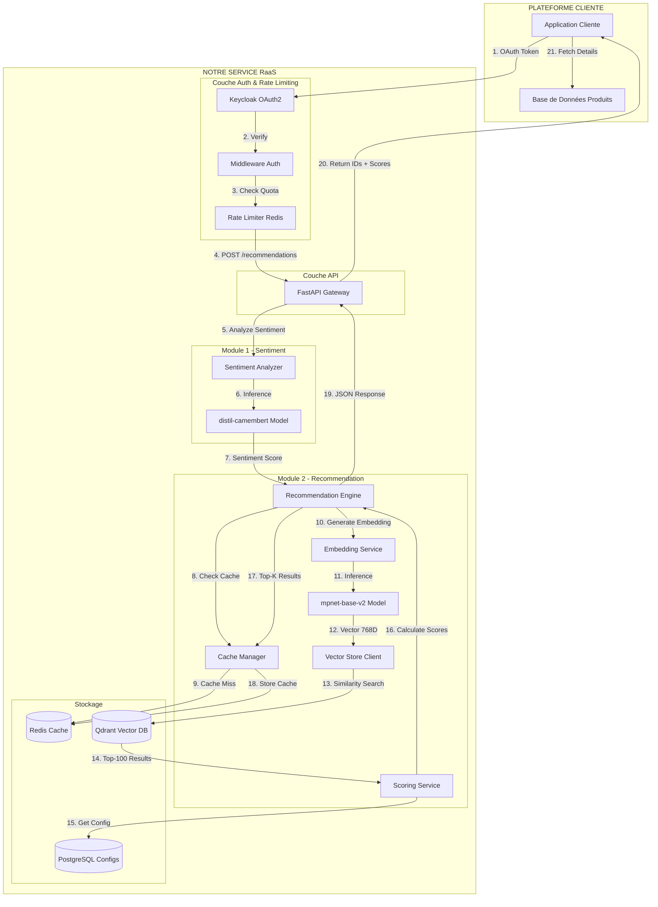
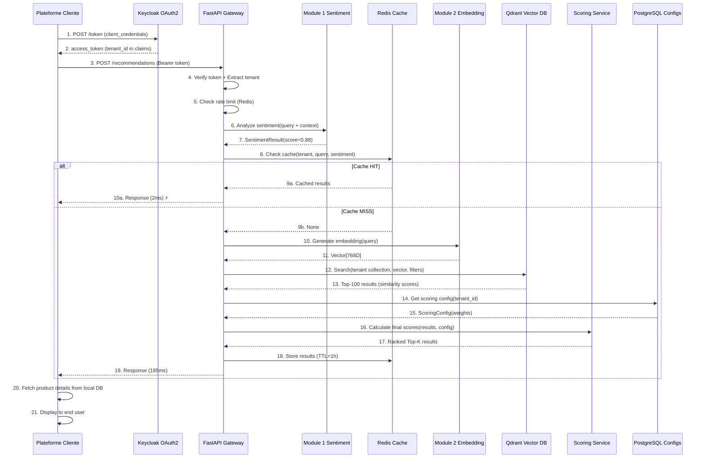

# 🔄 WORKFLOW COMPLET DE RECOMMANDATION MULTI-TENANT

## Vue d'Ensemble

Ce document détaille le flux complet d'une recommandation dans l'architecture multi-tenant, de l'analyse de sentiment jusqu'au scoring final et retour vers la plateforme cliente.

---

## 📊 Architecture Globale



---

## 🔍 Flux Détaillé Step-by-Step

### ÉTAPE 1-4: Authentification & Rate Limiting

```
┌─────────────────────────────────────────────────────────────┐
│  PLATEFORME CLIENTE (Ex: Immobilier Pro)                    │
├─────────────────────────────────────────────────────────────┤
│                                                              │
│  1. Un client laisse un commentaire sur un produit:         │
│     Client ID: "client_456"                                  │
│     Produit ID: "prod_abc123"                                │
│     Commentaire: "Excellent appartement, très lumineux !"   │
│                                                              │
│  2. Application prépare requête API:                        │
│                                                              │
│     const request = {                                        │
│       client_id: "client_456",                              │
│       product_id: "prod_abc123",                            │
│       comment: "Excellent appartement, très lumineux !",    │
│       top_k: 10  // Optionnel, défaut: 10                   │
│     };                                                       │
│                                                              │
│  3. Obtient access_token OAuth2 (si expiré):               │
│                                                              │
│     POST https://keycloak:8080/realms/raas/protocol/        │
│          openid-connect/token                               │
│                                                              │
│     Body:                                                    │
│       grant_type: client_credentials                        │
│       client_id: immopro_client                             │
│       client_secret: xxx                                    │
│                                                              │
│     Response:                                                │
│       {                                                      │
│         "access_token": "eyJhbG...",                        │
│         "expires_in": 300,                                   │
│         "token_type": "Bearer",                             │
│         "tenant_id": "immopro_123"  ← Custom claim         │
│       }                                                      │
│                                                              │
│  4. Envoie requête avec token:                             │
│                                                              │
│     POST https://api.raas.com/api/v1/tenants/immopro_123/   │
│          recommendations                                     │
│                                                              │
│     Headers:                                                 │
│       Authorization: Bearer eyJhbG...                       │
│       Content-Type: application/json                        │
│       X-Request-ID: uuid-1234                               │
│                                                              │
│     Body: { client_id, product_id, comment, top_k }         │
│                                                              │
└─────────────────────────────────────────────────────────────┘
                           │
                           ▼
┌─────────────────────────────────────────────────────────────┐
│  MIDDLEWARE: Authentification                                │
├─────────────────────────────────────────────────────────────┤
│                                                              │
│  1. Extrait token Bearer:                                   │
│     token = headers["Authorization"].split("Bearer ")[1]    │
│                                                              │
│  2. Vérifie token avec Keycloak:                           │
│                                                              │
│     token_info = keycloak_openid.introspect(token)         │
│                                                              │
│     if not token_info["active"]:                            │
│         raise HTTPException(401, "Token expired")           │
│                                                              │
│  3. Extrait tenant_id du token:                            │
│     tenant_id = token_info["tenant_id"]                     │
│                                                              │
│  4. Récupère tenant depuis PostgreSQL:                     │
│                                                              │
│     tenant = await db.query(Tenant)                         │
│                    .filter(Tenant.tenant_id == tenant_id)   │
│                    .first()                                  │
│                                                              │
│     if not tenant or tenant.status != "active":             │
│         raise HTTPException(403, "Tenant inactive")         │
│                                                              │
│  5. Vérifie correspondance tenant_id URL vs token:         │
│     if request.path_params["tenant_id"] != tenant_id:       │
│         raise HTTPException(403, "Access denied")           │
│                                                              │
│  6. Ajoute tenant au request state:                        │
│     request.state.tenant = tenant                           │
│                                                              │
└─────────────────────────────────────────────────────────────┘
                           │
                           ▼
┌─────────────────────────────────────────────────────────────┐
│  MIDDLEWARE: Rate Limiting                                   │
├─────────────────────────────────────────────────────────────┤
│                                                              │
│  1. Récupère config rate limit du tenant:                  │
│     limit_per_minute = tenant.rate_limit_per_minute         │
│     burst = tenant.rate_limit_burst                         │
│                                                              │
│  2. Clé Redis:                                              │
│     key = f"rate_limit:{tenant_id}:minute"                  │
│     window = 60  # secondes                                 │
│                                                              │
│  3. Incrémente compteur atomique:                           │
│                                                              │
│     count = redis.incr(key)                                 │
│     redis.expire(key, window)                               │
│                                                              │
│  4. Vérifie limite:                                         │
│                                                              │
│     if count > limit_per_minute + burst:                    │
│         raise HTTPException(                                 │
│             status_code=429,                                 │
│             detail="Rate limit exceeded",                    │
│             headers={                                        │
│                 "X-RateLimit-Limit": limit_per_minute,      │
│                 "X-RateLimit-Remaining": 0,                 │
│                 "X-RateLimit-Reset": timestamp + 60         │
│             }                                                │
│         )                                                    │
│                                                              │
│  5. Ajoute headers de rate limit à la réponse:             │
│     response.headers["X-RateLimit-Limit"] = limit           │
│     response.headers["X-RateLimit-Remaining"] = remaining   │
│                                                              │
└─────────────────────────────────────────────────────────────┘
                           │
                           ▼
```

**Temps écoulé: ~5ms** (vérification token + Redis)

---

### ÉTAPE 5-7: Analyse de Sentiment

```
┌─────────────────────────────────────────────────────────────┐
│  ENDPOINT: POST /tenants/{tenant_id}/recommendations        │
├─────────────────────────────────────────────────────────────┤
│                                                              │
│  @router.post("/tenants/{tenant_id}/recommendations")       │
│  async def get_recommendations(                             │
│      tenant_id: str,                                         │
│      request: RecommendationRequest,                        │
│      tenant: Tenant = Depends(verify_tenant_access)         │
│  ):                                                          │
│      start_time = time.time()                               │
│                                                              │
│      # 1. Extraire les données de la requête                │
│      client_id = request.client_id                          │
│      product_id = request.product_id                        │
│      comment = request.comment                              │
│      top_k = request.top_k or 10                            │
│                                                              │
│      # 2. Analyse sentiment du commentaire                  │
│      sentiment_result = await sentiment_analyzer.analyze(   │
│          text=comment                                       │
│      )                                                       │
│                                                              │
└─────────────────────────────────────────────────────────────┘
                           │
                           ▼
┌─────────────────────────────────────────────────────────────┐
│  MODULE 1: Sentiment Analyzer                                │
├─────────────────────────────────────────────────────────────┤
│                                                              │
│  async def analyze(self, text: str) -> SentimentResult:     │
│                                                              │
│      # 1. Tokenization                                      │
│      inputs = self.tokenizer(                               │
│          text,                                              │
│          return_tensors="pt",                               │
│          truncation=True,                                    │
│          max_length=512,                                     │
│          padding=True                                        │
│      )                                                       │
│                                                              │
│      # Exemple de tokens:                                   │
│      # "appartement lumineux balcon Paris"                  │
│      # → [101, 2341, 8832, 5521, 3421, 102]               │
│                                                              │
│      # 2. Inference dans modèle (distil-camembert)         │
│      with torch.no_grad():                                  │
│          outputs = self.model(**inputs)                     │
│          logits = outputs.logits                            │
│                                                              │
│      # logits: Tensor([[-2.3, 0.1, 3.8]])                  │
│      #   negative=0, neutral=1, positive=2                  │
│                                                              │
│      # 3. Softmax pour probabilités                        │
│      probs = torch.softmax(logits, dim=-1)                 │
│                                                              │
│      # probs: [0.02, 0.10, 0.88]                           │
│      #   → 88% positive                                     │
│                                                              │
│      # 4. Prédiction                                        │
│      predicted_class = torch.argmax(probs, dim=-1).item()  │
│      confidence = probs[0][predicted_class].item()         │
│                                                              │
│      # predicted_class = 2 (positive)                       │
│      # confidence = 0.88                                    │
│                                                              │
│      # 5. Conversion en score -1 à +1                      │
│      score_map = {                                          │
│          0: -1.0,   # negative                              │
│          1: 0.0,    # neutral                               │
│          2: +1.0    # positive                              │
│      }                                                       │
│                                                              │
│      raw_score = score_map[predicted_class]                │
│      sentiment_score = raw_score * confidence               │
│                                                              │
│      # sentiment_score = 1.0 * 0.88 = 0.88                 │
│                                                              │
│      return SentimentResult(                                │
│          label="positive",                                  │
│          score=0.88,                                        │
│          confidence=0.88                                    │
│      )                                                       │
│                                                              │
└─────────────────────────────────────────────────────────────┘
```

**Temps écoulé: ~45ms** (inference sentiment)

**Résultat:**
```json
{
  "label": "positive",
  "score": 0.88,
  "confidence": 0.88
}
```

---

### ÉTAPE 8-9: Vérification Cache

```
┌─────────────────────────────────────────────────────────────┐
│  MODULE 2: Recommendation Engine - Cache Check              │
├─────────────────────────────────────────────────────────────┤
│                                                              │
│  # Suite du endpoint...                                     │
│                                                              │
│  # 3. Vérification cache                                    │
│  cache_key = self._generate_cache_key(                      │
│      tenant_id=tenant_id,                                   │
│      query=user_query,                                      │
│      sentiment_score=sentiment_result.score,                │
│      filters=request.filters,                                │
│      top_k=request.top_k                                    │
│  )                                                           │
│                                                              │
│  # Génération clé (hash stable):                            │
│  # cache:rec:immopro_123:hash(query+filters):0.88:10       │
│                                                              │
│  cached_result = await cache_manager.get(cache_key)        │
│                                                              │
│  if cached_result:                                          │
│      # CACHE HIT                                            │
│      logger.info(                                            │
│          "cache_hit",                                        │
│          tenant_id=tenant_id,                               │
│          cache_key=cache_key                                │
│      )                                                       │
│                                                              │
│      return RecommendationResponse(                         │
│          recommendations=cached_result,                     │
│          sentiment=sentiment_result,                        │
│          processing_time_ms=2,                              │
│          cached=True                                        │
│      )                                                       │
│                                                              │
└─────────────────────────────────────────────────────────────┘
```

**Cache HIT:** Retour immédiat en **~2ms** total

**Cache MISS:** Continue vers récupération produit...

---

### ÉTAPE 10: Récupération Description Produit

```
┌─────────────────────────────────────────────────────────────┐
│  MODULE 2: Vector Store - Retrieve Product                  │
├─────────────────────────────────────────────────────────────┤
│                                                              │
│  # 4. Récupère la description du produit commenté           │
│  collection_name = f"tenant_{tenant_id}"                    │
│                                                              │
│  product_point = await vector_store.retrieve(               │
│      collection_name=collection_name,                       │
│      ids=[product_id]                                       │
│  )                                                           │
│                                                              │
│  # product_point contient:                                  │
│  {                                                           │
│    "id": "prod_abc123",                                     │
│    "vector": [...],  # Vecteur 768D (déjà calculé)         │
│    "payload": {                                             │
│      "id": "prod_abc123",                                   │
│      "description": "Appartement 3 pièces 72m², lumineux,  │
│                      avec balcon, Paris 15e, proche métro", │
│      "metadata": {                                          │
│        "price": 280000,                                     │
│        "surface": 72,                                       │
│        "rooms": 3,                                          │
│        "location": "Paris 15e"                              │
│      }                                                       │
│    }                                                         │
│  }                                                           │
│                                                              │
│  product_description = product_point.payload["description"] │
│                                                              │
└─────────────────────────────────────────────────────────────┘
```

**Temps écoulé: ~3ms** (retrieve by ID from Qdrant)

---

### ÉTAPE 11-12: Génération Embedding

```
┌─────────────────────────────────────────────────────────────┐
│  MODULE 2: Embedding Service                                 │
├─────────────────────────────────────────────────────────────┤
│                                                              │
│  # 5. Génération embedding de la description du produit     │
│  product_embedding = await embedding_service.generate(      │
│      text=product_description,                              │
│      sentiment_boost=sentiment_result.score                 │
│  )                                                           │
│                                                              │
│  # Note: On vectorise la DESCRIPTION du produit commenté,   │
│  # pas le commentaire lui-même !                            │
│                                                              │
└─────────────────────────────────────────────────────────────┘
                           │
                           ▼
┌─────────────────────────────────────────────────────────────┐
│  EMBEDDING SERVICE: mpnet-base-v2                            │
├─────────────────────────────────────────────────────────────┤
│                                                              │
│  async def generate(                                         │
│      self,                                                   │
│      text: str,                                             │
│      sentiment_boost: float = 0.0                           │
│  ) -> List[float]:                                          │
│                                                              │
│      # 1. Préparation texte                                 │
│      text_normalized = self._normalize_text(text)           │
│                                                              │
│      # Exemple:                                              │
│      # "appartement lumineux balcon Paris"                  │
│      # → "appartement lumineux balcon paris"               │
│                                                              │
│      # 2. Tokenization                                      │
│      inputs = self.tokenizer(                               │
│          text_normalized,                                   │
│          return_tensors="pt",                               │
│          truncation=True,                                    │
│          max_length=512,                                     │
│          padding=True                                        │
│      )                                                       │
│                                                              │
│      # 3. Inference dans mpnet-base-v2                     │
│      with torch.no_grad():                                  │
│          model_output = self.model(**inputs)                │
│                                                              │
│      # 4. Mean pooling (moyenne des token embeddings)      │
│      embeddings = self._mean_pooling(                       │
│          model_output,                                      │
│          inputs["attention_mask"]                           │
│      )                                                       │
│                                                              │
│      # 5. Normalisation L2 (vecteur unitaire)              │
│      embeddings = F.normalize(embeddings, p=2, dim=1)       │
│                                                              │
│      # Résultat: Tensor de shape [1, 768]                  │
│      embedding_vector = embeddings[0].cpu().numpy()         │
│                                                              │
│      # Exemple (tronqué):                                   │
│      # [0.0234, -0.1123, 0.0891, ..., 0.0456]              │
│      # (768 dimensions)                                      │
│                                                              │
│      # 6. Boost optionnel basé sur sentiment               │
│      if sentiment_boost != 0.0:                             │
│          # Augmente légèrement la magnitude pour sentiment │
│          # positif (plus de poids dans la recherche)       │
│          boost_factor = 1.0 + (sentiment_boost * 0.05)     │
│          embedding_vector *= boost_factor                   │
│                                                              │
│      return embedding_vector.tolist()                       │
│                                                              │
└─────────────────────────────────────────────────────────────┘
```

**Temps écoulé: ~80ms** (inference embedding)

**Résultat:**
```python
embedding_vector = [
    0.0234, -0.1123, 0.0891, 0.0567, -0.0234, ...  # 768 valeurs
]
```

---

### ÉTAPE 13-14: Recherche Vectorielle Qdrant

```
┌─────────────────────────────────────────────────────────────┐
│  MODULE 2: Vector Store Client                               │
├─────────────────────────────────────────────────────────────┤
│                                                              │
│  # 5. Recherche similarité dans Qdrant                      │
│  collection_name = f"tenant_{tenant_id}"                    │
│  # Ex: "tenant_immopro_123"                                 │
│                                                              │
│  search_results = await vector_store.search(                │
│      collection_name=collection_name,                       │
│      query_vector=query_embedding,                          │
│      limit=100,  # Sur-échantillonnage pour re-ranking     │
│      score_threshold=0.5,  # Minimum similarité            │
│      filters=self._build_qdrant_filters(request.filters)   │
│  )                                                           │
│                                                              │
└─────────────────────────────────────────────────────────────┘
                           │
                           ▼
┌─────────────────────────────────────────────────────────────┐
│  QDRANT: Recherche HNSW                                      │
├─────────────────────────────────────────────────────────────┤
│                                                              │
│  # Algorithme HNSW (Hierarchical Navigable Small World)    │
│                                                              │
│  1. Collecte ciblée:                                        │
│     - Collection: tenant_immopro_123                        │
│     - Vecteurs stockés: 50,000 produits                    │
│                                                              │
│  2. Filtres optionnels:                                     │
│     {                                                        │
│       "must": [                                             │
│         {                                                   │
│           "key": "metadata.price",                          │
│           "range": {                                         │
│             "lte": 500000                                   │
│           }                                                  │
│         },                                                   │
│         {                                                   │
│           "key": "metadata.rooms",                          │
│           "range": {                                         │
│             "gte": 3                                        │
│           }                                                  │
│         }                                                    │
│       ]                                                      │
│     }                                                        │
│                                                              │
│  3. Recherche HNSW:                                         │
│     - Calcul cosine similarity entre query_vector et        │
│       tous les vecteurs éligibles (après filtres)           │
│                                                              │
│     - Cosine Similarity Formula:                            │
│       sim = dot(v1, v2) / (||v1|| * ||v2||)                │
│       Résultat entre -1 et 1 (1 = identique)               │
│                                                              │
│  4. Tri décroissant par score:                             │
│                                                              │
│     Résultats (top-100):                                    │
│     [                                                        │
│       {                                                     │
│         "id": "qdrant_uuid_001",                            │
│         "score": 0.923,  # Similarité                       │
│         "payload": {                                         │
│           "id": "prod_abc123",  # ID plateforme            │
│           "metadata": {                                      │
│             "price": 280000,                                │
│             "surface": 72,                                  │
│             "rooms": 3,                                     │
│             "location": "Paris 15e",                        │
│             "availability": 1.0,                            │
│             "reputation": 0.85                              │
│           }                                                  │
│         }                                                    │
│       },                                                     │
│       {                                                     │
│         "id": "qdrant_uuid_002",                            │
│         "score": 0.891,                                     │
│         "payload": {...}                                    │
│       },                                                     │
│       ...                                                    │
│       (98 autres résultats)                                 │
│     ]                                                        │
│                                                              │
└─────────────────────────────────────────────────────────────┘
```

**Temps écoulé: ~12ms** (recherche HNSW optimisée)

---

### ÉTAPE 15-16: Scoring Personnalisé

```
┌─────────────────────────────────────────────────────────────┐
│  MODULE 2: Scoring Service                                   │
├─────────────────────────────────────────────────────────────┤
│                                                              │
│  # 6. Récupération config scoring du tenant                 │
│  scoring_config = await scoring_service.get_config(         │
│      tenant_id=tenant_id                                    │
│  )                                                           │
│                                                              │
│  # Exemple de config (depuis PostgreSQL):                   │
│  {                                                           │
│    "similarity_weight": 0.70,                               │
│    "price_weight": 0.15,                                    │
│    "availability_weight": 0.10,                             │
│    "reputation_weight": 0.05,                               │
│    "custom_criteria": {}                                    │
│  }                                                           │
│                                                              │
│  # 7. Calcul scores finaux                                  │
│  ranked_results = await scoring_service.calculate_scores(   │
│      results=search_results,                                │
│      config=scoring_config                                  │
│  )                                                           │
│                                                              │
└─────────────────────────────────────────────────────────────┘
                           │
                           ▼
┌─────────────────────────────────────────────────────────────┐
│  CALCUL DES SCORES FINAUX                                    │
├─────────────────────────────────────────────────────────────┤
│                                                              │
│  Pour chaque résultat dans top-100:                         │
│                                                              │
│  Exemple Produit 1 (prod_abc123):                           │
│  ─────────────────────────────────────────                  │
│                                                              │
│  1. Scores bruts:                                           │
│     - Similarity (Qdrant): 0.923                            │
│     - Price (metadata): 280000                              │
│     - Availability (metadata): 1.0                          │
│     - Reputation (metadata): 0.85                           │
│                                                              │
│  2. Normalisation:                                          │
│                                                              │
│     a) Similarity: Déjà normalisé (0-1) → 0.923            │
│                                                              │
│     b) Price: Inverse normalized                            │
│        # Plus le prix est bas, meilleur le score           │
│        max_price_in_results = 500000                        │
│        price_score = 1 - (280000 / 500000)                 │
│        price_score = 1 - 0.56 = 0.44                       │
│                                                              │
│     c) Availability: Déjà normalisé → 1.0                  │
│                                                              │
│     d) Reputation: Déjà normalisé → 0.85                   │
│                                                              │
│  3. Application des poids:                                  │
│                                                              │
│     final_score =                                           │
│         (0.923 × 0.70)  # Similarity                        │
│       + (0.44  × 0.15)  # Price                             │
│       + (1.0   × 0.10)  # Availability                      │
│       + (0.85  × 0.05)  # Reputation                        │
│                                                              │
│     final_score =                                           │
│         0.6461  # Similarity contribution                   │
│       + 0.066   # Price contribution                        │
│       + 0.10    # Availability contribution                 │
│       + 0.0425  # Reputation contribution                   │
│                                                              │
│     final_score = 0.8546                                    │
│                                                              │
│  4. Résultat scoré:                                         │
│     {                                                        │
│       "product_id": "prod_abc123",                          │
│       "similarity_score": 0.923,                            │
│       "final_score": 0.8546,                                │
│       "score_breakdown": {                                   │
│         "similarity": 0.6461,                               │
│         "price": 0.066,                                     │
│         "availability": 0.10,                               │
│         "reputation": 0.0425                                │
│       },                                                     │
│       "metadata": {...}                                     │
│     }                                                        │
│                                                              │
│  ──────────────────────────────────────────────────────────│
│                                                              │
│  Répéter pour les 100 résultats...                         │
│                                                              │
│  5. Tri final décroissant par final_score                   │
│                                                              │
│  6. Sélection Top-K (10 demandés):                         │
│                                                              │
│     [                                                        │
│       {"product_id": "prod_abc123", "score": 0.8546},      │
│       {"product_id": "prod_xyz789", "score": 0.8421},      │
│       {"product_id": "prod_def456", "score": 0.8312},      │
│       ...                                                    │
│       {"product_id": "prod_ghi012", "score": 0.7856}       │
│     ]                                                        │
│                                                              │
└─────────────────────────────────────────────────────────────┘
```

**Temps écoulé: ~25ms** (calcul 100 scores + tri)

---

### ÉTAPE 17-18: Mise en Cache

```
┌─────────────────────────────────────────────────────────────┐
│  CACHE MANAGER: Sauvegarde Redis                             │
├─────────────────────────────────────────────────────────────┤
│                                                              │
│  # 8. Stockage dans cache                                   │
│  await cache_manager.set(                                   │
│      key=cache_key,                                         │
│      value=ranked_results[:request.top_k],                  │
│      ttl=3600  # 1 heure                                    │
│  )                                                           │
│                                                              │
│  # Redis:                                                    │
│  SET cache:rec:immopro_123:hash(...):0.88:10                │
│      '[{...}, {...}, ...]'                                  │
│      EX 3600                                                 │
│                                                              │
└─────────────────────────────────────────────────────────────┘
```

**Temps écoulé: ~3ms** (write Redis)

---

### ÉTAPE 19-20: Réponse JSON

```
┌─────────────────────────────────────────────────────────────┐
│  API RESPONSE                                                │
├─────────────────────────────────────────────────────────────┤
│                                                              │
│  # 9. Formater réponse simplifiée                           │
│  response = RecommendationResponse(                         │
│      client_id=client_id,                                   │
│      product_ids=[r.product_id for r in ranked_results]    │
│  )                                                           │
│                                                              │
│  return response                                            │
│                                                              │
└─────────────────────────────────────────────────────────────┘
                           │
                           ▼
┌─────────────────────────────────────────────────────────────┐
│  JSON Response vers Plateforme                               │
├─────────────────────────────────────────────────────────────┤
│                                                              │
│  HTTP 200 OK                                                 │
│                                                              │
│  Headers:                                                    │
│    Content-Type: application/json                           │
│    X-Request-ID: uuid-1234                                  │
│    X-RateLimit-Limit: 500                                   │
│    X-RateLimit-Remaining: 487                               │
│    X-RateLimit-Reset: 1705334400                            │
│                                                              │
│  Body (SIMPLIFIÉ):                                          │
│  {                                                           │
│    "client_id": "client_456",                               │
│    "product_ids": [                                         │
│      "prod_abc123",                                         │
│      "prod_xyz789",                                         │
│      "prod_def456",                                         │
│      "prod_ghi012",                                         │
│      "prod_jkl345",                                         │
│      "prod_mno678",                                         │
│      "prod_pqr901",                                         │
│      "prod_stu234",                                         │
│      "prod_vwx567",                                         │
│      "prod_yza890"                                          │
│    ]                                                         │
│  }                                                           │
│                                                              │
└─────────────────────────────────────────────────────────────┘
```

**Temps total (cache miss): ~185ms**

---

### ÉTAPE 21: Plateforme Récupère Détails

```
┌─────────────────────────────────────────────────────────────┐
│  PLATEFORME CLIENTE: Enrichissement                          │
├─────────────────────────────────────────────────────────────┤
│                                                              │
│  # 1. Reçoit liste d'IDs + scores de notre API             │
│  recommendation_ids = [                                      │
│      "prod_abc123",                                         │
│      "prod_xyz789",                                         │
│      ...                                                     │
│  ]                                                           │
│                                                              │
│  # 2. Requête dans LEUR base de données                    │
│  products = await db.query(Product)                         │
│                    .filter(Product.id.in_(recommendation_ids))│
│                    .all()                                    │
│                                                              │
│  # 3. Récupère détails complets:                           │
│  [                                                           │
│    {                                                         │
│      "id": "prod_abc123",                                   │
│      "title": "Appartement 3P Paris 15e",                  │
│      "description": "Magnifique appartement lumineux...",  │
│      "price": 280000,                                       │
│      "images": ["url1.jpg", "url2.jpg"],                   │
│      "features": {                                           │
│        "surface": 72,                                       │
│        "rooms": 3,                                          │
│        "floor": 4,                                          │
│        "elevator": true,                                    │
│        "balcony": true                                      │
│      },                                                      │
│      "location": {                                           │
│        "address": "12 Rue de Vaugirard",                   │
│        "city": "Paris",                                     │
│        "postal_code": "75015",                              │
│        "lat": 48.8426,                                      │
│        "lng": 2.3089                                        │
│      },                                                      │
│      "agent": {                                              │
│        "name": "Marie Dupont",                              │
│        "phone": "+33 6 12 34 56 78",                        │
│        "agency": "Immobilier Pro"                           │
│      }                                                       │
│    },                                                        │
│    ...                                                       │
│  ]                                                           │
│                                                              │
│  # 4. Affiche à l'utilisateur final                        │
│  render_recommendations(products, scores)                   │
│                                                              │
└─────────────────────────────────────────────────────────────┘
```

**Temps côté plateforme: ~20ms** (requête DB locale)

---

## ⚡ Résumé des Performances

### Cache MISS (Première Requête)

| Étape | Composant | Temps |
|-------|-----------|-------|
| 1-4 | Auth + Rate Limiting | ~5ms |
| 5-7 | Sentiment Analysis | ~45ms |
| 8-9 | Cache Check | ~2ms |
| 10-12 | Embedding Generation | ~80ms |
| 13-14 | Qdrant Vector Search | ~12ms |
| 15-16 | Scoring Calculation | ~25ms |
| 17-18 | Cache Storage | ~3ms |
| 19-20 | Response Formatting | ~3ms |
| **TOTAL** | | **~175ms** |

### Cache HIT (Requêtes Suivantes)

| Étape | Composant | Temps |
|-------|-----------|-------|
| 1-4 | Auth + Rate Limiting | ~5ms |
| 5-7 | Sentiment Analysis | ~45ms |
| 8-9 | Cache Check (HIT) | ~2ms |
| 19-20 | Response Formatting | ~1ms |
| **TOTAL** | | **~53ms** |

**Amélioration avec cache: ~3x plus rapide**

---

## 🔄 Diagramme de Séquence Complet



---

## 📦 Format de Données aux Points Clés

### 1. Requête Initiale (Client → API)

```json
{
  "client_id": "client_456",
  "product_id": "prod_abc123",
  "comment": "Excellent appartement, très lumineux avec un beau balcon !",
  "top_k": 10
}
```

### 2. Résultat Sentiment

```json
{
  "label": "positive",
  "score": 0.88,
  "confidence": 0.88
}
```

### 3. Embedding Vector (768D)

```json
[0.0234, -0.1123, 0.0891, 0.0567, ..., 0.0456]
```

### 4. Résultats Qdrant (Top-100)

```json
[
  {
    "id": "qdrant_uuid_001",
    "score": 0.923,
    "payload": {
      "id": "prod_abc123",
      "metadata": {
        "price": 280000,
        "surface": 72,
        "rooms": 3,
        "location": "Paris 15e",
        "availability": 1.0,
        "reputation": 0.85
      }
    }
  },
  ...
]
```

### 5. Config Scoring Dynamique (PostgreSQL)

```json
{
  "tenant_id": "immopro_123",
  "scoring_criteria": [
    {
      "name": "similarity",
      "weight": 0.70,
      "type": "system",
      "description": "Similarité sémantique (toujours présent)"
    },
    {
      "name": "price_match",
      "weight": 0.15,
      "type": "custom",
      "metadata_key": "price",
      "normalization": "inverse",
      "description": "Correspondance de prix (plus bas = mieux)"
    },
    {
      "name": "availability",
      "weight": 0.10,
      "type": "custom",
      "metadata_key": "available",
      "normalization": "direct",
      "description": "Disponibilité immédiate"
    },
    {
      "name": "reputation",
      "weight": 0.05,
      "type": "custom",
      "metadata_key": "rating",
      "normalization": "direct",
      "description": "Note moyenne"
    }
  ]
}
```

**Note:** Les critères sont **complètement configurables** par tenant via l'interface admin. L'admin peut:
- Ajouter un nouveau critère
- Supprimer un critère
- Modifier les poids
- Changer la normalisation (direct, inverse, custom)

### 6. Résultats Scorés Finaux (Top-10)

```json
[
  {
    "product_id": "prod_abc123",
    "final_score": 0.8546,
    "similarity_score": 0.923,
    "score_breakdown": {
      "similarity": 0.6461,
      "price": 0.066,
      "availability": 0.10,
      "reputation": 0.0425
    },
    "metadata": {
      "price": 280000,
      "surface": 72,
      "rooms": 3,
      "location": "Paris 15e"
    }
  },
  ...
]
```

### 7. Réponse API Finale (Simplifiée)

```json
{
  "client_id": "client_456",
  "product_ids": [
    "prod_abc123",
    "prod_xyz789",
    "prod_def456",
    "prod_ghi012",
    "prod_jkl345",
    "prod_mno678",
    "prod_pqr901",
    "prod_stu234",
    "prod_vwx567",
    "prod_yza890"
  ]
}
```

**Note:** Réponse ultra-simplifiée :
- `client_id` : Pour qui sont ces recommandations
- `product_ids` : Liste des IDs des produits recommandés (dans l'ordre de pertinence)
- Pas de scores, pas de metadata, pas de surcharge JSON

---

## 🔐 Sécurité & Isolation

### Par Étape

1. **Auth OAuth2**: Token JWT vérifié avec Keycloak
2. **Rate Limiting**: Quotas par tenant (client_id)
3. **Tenant Isolation**:
   - Collection Qdrant dédiée (`tenant_{id}`)
   - Cache Redis préfixé (`cache:rec:{tenant_id}:...`)
   - Config scoring séparée (PostgreSQL)
4. **Validation**: Pydantic schemas à chaque étape
5. **Logging**: Correlation ID pour traçabilité

---

## 📊 Métriques & Monitoring

### Métriques Collectées

- **Requêtes/min** par tenant
- **Latence** (P50, P95, P99)
- **Cache hit rate** par tenant
- **Taux d'erreur** par endpoint
- **Quotas consommés** (rate limiting)
- **Coût IA** (inférences modèles)

### Stockage Métriques

- **Redis**: Compteurs temps réel (rolling window)
- **PostgreSQL**: Historique agrégé (métriques journalières)
- **Interface Web**: Dashboards Recharts

---

## 🚀 Optimisations Possibles

1. **Batch Embeddings**: Générer embeddings de plusieurs requêtes en parallèle
2. **GPU Inference**: Accélération PyTorch (45ms → 10ms sentiment, 80ms → 20ms embedding)
3. **Qdrant Sharding**: Distribuer collections sur plusieurs nœuds
4. **CDN Cache**: Mettre un CDN devant l'API pour requêtes populaires
5. **Pre-warming Cache**: Pré-calculer recommandations pour queries fréquentes

---

**Version:** 1.0
**Date:** 2025-01-15
