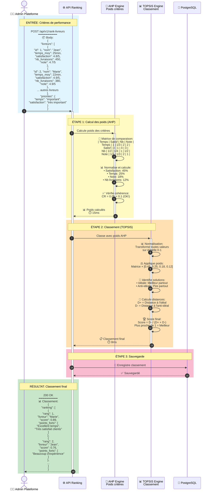

# 🏗️ Architecture Complète du Système AR_AS

> **Pour bien comprendre**: Ce document explique comment fonctionne le système AR_AS de recommandation de véhicules, comme si on expliquait à un enfant de CM2.

## 📚 Table des Matières

1. [Vue d'ensemble Simple](#vue-densemble-simple)
2. [Architecture Complète Détaillée](#architecture-complète-détaillée)
3. [Flux de Données - Recommandation](#flux-de-données---recommandation)
4. [Flux de Données - Ranking Livreurs](#flux-de-données---ranking-livreurs)
5. [Système de Monitoring](#système-de-monitoring)
6. [Explication de Chaque Composant](#explication-de-chaque-composant)

---

## 🎯 Vue d'ensemble Simple

**Imagine que le système AR_AS est comme une grande usine qui aide les gens à choisir le meilleur véhicule:**

1. **Un client arrive** et dit "J'ai vu ce véhicule, j'ai laissé un commentaire"
2. **L'usine analyse** le commentaire pour savoir si le client est content ou pas
3. **L'usine cherche** dans sa base de véhicules similaires
4. **L'usine recommande** les 10 meilleurs véhicules au client
5. **Pendant ce temps**, des employés surveillent que tout fonctionne bien

---

## 🏗️ Architecture Complète Détaillée

```mermaid
graph TB
    subgraph "👤 UTILISATEUR"
        USER[Client/Utilisateur<br/>━━━━━━━━━━━━<br/>📝 Envoie: Commentaire + ID véhicule<br/>📥 Reçoit: Liste de recommandations]
    end

    subgraph "🌐 COUCHE API - Point d'Entrée"
        API[FastAPI - Serveur API<br/>━━━━━━━━━━━━<br/>🔹 Rôle: Porte d'entrée du système<br/>📨 Reçoit: Requêtes HTTP<br/>📤 Retourne: Réponses JSON<br/>⚡ Port: 8000<br/>👷 Workers: 4 processus parallèles]

        MIDDLEWARE[Middlewares<br/>━━━━━━━━━━━━<br/>🔹 Correlation ID: Numéro de suivi<br/>🔹 Logging: Enregistre tout<br/>🔹 Rate Limit: Limite les abus]
    end

    subgraph "🧠 MODULE 1 - ANALYSE DES SENTIMENTS"
        SENTIMENT[Analyseur de Sentiments<br/>━━━━━━━━━━━━<br/>🤖 Modèle: distil-camembert<br/>📥 Entrée: Texte du commentaire<br/>🔍 Traitement: IA analyse les émotions<br/>📊 Sortie: Score -1 à +1<br/>   • Positif +0.8 = Très content 😊<br/>   • Négatif -0.6 = Pas content 😞<br/>   • Neutre 0.0 = Ni content ni pas content 😐]

        SENTIMENT_MODEL[(Modèle ML Sentiment<br/>━━━━━━━━━━━━<br/>📦 Fichiers: 500MB<br/>🗂️ Type: Transformers<br/>🌍 Langue: Français)]
    end

    subgraph "🎯 MODULE 2 - RECOMMANDATION"
        CACHE[Cache Redis<br/>━━━━━━━━━━━━<br/>💾 Rôle: Mémoire rapide<br/>⚡ Vitesse: Ultrarapide (ms)<br/>🔄 TTL: 1 heure<br/>📊 Contient: Résultats précédents]

        EMBEDDING[Générateur d'Embeddings<br/>━━━━━━━━━━━━<br/>🤖 Modèle: mpnet-base-v2<br/>📥 Entrée: Texte (description véhicule)<br/>🔢 Sortie: 768 nombres (vecteur)<br/>🔹 Rôle: Transforme texte en nombres<br/>   que l'ordinateur comprend]

        VECTOR[Base Vectorielle Qdrant<br/>━━━━━━━━━━━━<br/>🗄️ Contient: Tous les véhicules<br/>🔢 Format: Vecteurs 768 dimensions<br/>🔍 Fonction: Trouve les similaires<br/>⚡ Vitesse: Très rapide (KNN)<br/>📊 Exemple: 10,000 véhicules]

        RECOMMENDER[Moteur de Recommandation<br/>━━━━━━━━━━━━<br/>🧮 Calcule le score final:<br/>   • 60% Similarité sémantique<br/>   • 25% Disponibilité<br/>   • 15% Réputation<br/>📤 Retourne: Top 10 véhicules]
    end

    subgraph "📊 MODULE 3 - ORCHESTRATION"
        ORCHESTRATOR[Orchestrateur<br/>━━━━━━━━━━━━<br/>🎼 Rôle: Chef d'orchestre<br/>📋 Coordonne tous les modules<br/>🔄 Gère le workflow complet]

        CELERY_WORKER[Workers Celery x2<br/>━━━━━━━━━━━━<br/>👷 Rôle: Ouvriers du système<br/>⚙️ Font: Tâches longues en arrière-plan<br/>🔢 Nombre: 2 workers parallèles<br/>♻️ Recyclage: Après 1000 tâches]

        CELERY_BEAT[Celery Beat<br/>━━━━━━━━━━━━<br/>⏰ Rôle: Réveil automatique<br/>📅 Programme: Tâches périodiques<br/>🔁 Exemple: Health check toutes les 5min]

        FLOWER[Flower Dashboard<br/>━━━━━━━━━━━━<br/>📊 Rôle: Tableau de bord des tâches<br/>👀 Montre: Qui fait quoi en temps réel<br/>⚡ Port: 5555]
    end

    subgraph "🏪 MODULE 4 - RANKING LIVREURS"
        LIVREUR_API[API Ranking Livreurs<br/>━━━━━━━━━━━━<br/>🎯 Méthode: AHP + TOPSIS<br/>📥 Entrée: Critères de performance<br/>📊 Critères:<br/>   • Temps de livraison<br/>   • Taux de satisfaction<br/>   • Nombre de livraisons<br/>   • Note moyenne<br/>📤 Sortie: Classement des livreurs]
    end

    subgraph "💾 STOCKAGE DE DONNÉES"
        DB[(PostgreSQL Database<br/>━━━━━━━━━━━━<br/>🗄️ Stocke:<br/>   • Véhicules (id, nom, prix...)<br/>   • Clients<br/>   • Commentaires<br/>   • Historique<br/>⚡ Port: 5432<br/>💪 Connection Pool: 10-30)]

        REDIS[(Redis Cache<br/>━━━━━━━━━━━━<br/>⚡ Mémoire RAM ultrarapide<br/>💾 Taille: 512MB<br/>🔄 Politique: LRU (vire les vieux)<br/>📦 Stocke aussi: Files Celery)]

        QDRANT[(Qdrant Vector DB<br/>━━━━━━━━━━━━<br/>🎯 Spécialisé: Recherche vectorielle<br/>📊 Collections: vehicles<br/>🔢 Dimension: 768<br/>⚡ Port: 6333)]
    end

    subgraph "📈 MONITORING - Surveillance du Système"
        ELASTIC[Elasticsearch<br/>━━━━━━━━━━━━<br/>🔍 Moteur de recherche<br/>📊 Stocke: Tous les logs<br/>⚡ Port: 9200<br/>💾 Index par jour]

        LOGSTASH[Logstash<br/>━━━━━━━━━━━━<br/>🔄 Rôle: Transformateur de logs<br/>📥 Reçoit: Logs bruts<br/>🔧 Transforme: Nettoie et structure<br/>📤 Envoie: Vers Elasticsearch]

        KIBANA[Kibana Dashboard<br/>━━━━━━━━━━━━<br/>📊 Tableaux de bord visuels<br/>👀 Montre: Graphiques temps réel<br/>⚡ Port: 5601<br/>🎨 Dashboards: 3 personnalisés]

        APM[Elastic APM<br/>━━━━━━━━━━━━<br/>🔍 Trace: Chaque requête<br/>⏱️ Mesure: Temps d'exécution<br/>🐛 Détecte: Erreurs et lenteurs<br/>⚡ Port: 8200]

        FILEBEAT[Filebeat<br/>━━━━━━━━━━━━<br/>📝 Rôle: Collecteur de logs<br/>👁️ Surveille: Containers Docker<br/>📤 Envoie: Logs vers Logstash]

        METRICBEAT[Metricbeat<br/>━━━━━━━━━━━━<br/>📊 Collecte métriques:<br/>   • CPU, RAM containers<br/>   • Redis stats<br/>   • PostgreSQL stats<br/>   • Docker stats]
    end

    %% Relations Utilisateur → API
    USER -->|1. Requête HTTP<br/>POST /recommendations| API
    API -->|2. Passe par| MIDDLEWARE

    %% API → Orchestration
    MIDDLEWARE -->|3. Démarre workflow| ORCHESTRATOR

    %% Orchestration → Modules
    ORCHESTRATOR -->|4a. Analyse sentiment| SENTIMENT
    SENTIMENT -->|Charge modèle| SENTIMENT_MODEL
    SENTIMENT -->|4b. Score: +0.8| ORCHESTRATOR

    ORCHESTRATOR -->|5a. Vérifie cache| CACHE
    CACHE -->|Cache HIT: Retourne direct| ORCHESTRATOR
    CACHE -->|Cache MISS: Continue| ORCHESTRATOR

    ORCHESTRATOR -->|5b. Génère embedding| EMBEDDING
    EMBEDDING -->|5c. Vecteur 768D| VECTOR
    VECTOR -->|5d. 100 véhicules similaires| ORCHESTRATOR

    ORCHESTRATOR -->|6. Calcule scores finaux| RECOMMENDER
    RECOMMENDER -->|7. Top 10 véhicules| ORCHESTRATOR

    ORCHESTRATOR -->|8. Sauvegarde en cache| CACHE
    ORCHESTRATOR -->|9. Réponse finale| API
    API -->|10. JSON Response| USER

    %% Celery pour tâches async
    ORCHESTRATOR -.->|Tâches lourdes| CELERY_WORKER
    CELERY_BEAT -.->|Planifie tâches| CELERY_WORKER
    CELERY_WORKER <-->|File de messages| REDIS
    FLOWER -.->|Surveille| CELERY_WORKER

    %% Accès aux bases de données
    ORCHESTRATOR <-->|Lit/Écrit données| DB
    RECOMMENDER <-->|Infos véhicules| DB
    EMBEDDING <-->|Stocke vecteurs| QDRANT
    LIVREUR_API <-->|Données livreurs| DB

    %% Monitoring - Tous les services envoient des logs
    API -.->|Logs JSON| FILEBEAT
    CELERY_WORKER -.->|Logs tâches| FILEBEAT
    SENTIMENT -.->|Métriques ML| FILEBEAT
    RECOMMENDER -.->|Métriques perfs| FILEBEAT

    FILEBEAT -->|Stream logs| LOGSTASH
    LOGSTASH -->|Logs structurés| ELASTIC
    ELASTIC <-->|Visualise| KIBANA

    API -.->|Traces APM| APM
    APM -->|Stocke traces| ELASTIC

    METRICBEAT -.->|Métriques infra| ELASTIC
    DB -.->|Stats PostgreSQL| METRICBEAT
    REDIS -.->|Stats Redis| METRICBEAT

    %% Styling
    classDef userClass fill:#E1F5FE,stroke:#01579B,stroke-width:3px,color:#000
    classDef apiClass fill:#C8E6C9,stroke:#2E7D32,stroke-width:2px,color:#000
    classDef mlClass fill:#FFE0B2,stroke:#E65100,stroke-width:2px,color:#000
    classDef dataClass fill:#F8BBD0,stroke:#880E4F,stroke-width:2px,color:#000
    classDef monitorClass fill:#D1C4E9,stroke:#4A148C,stroke-width:2px,color:#000
    classDef orchestClass fill:#FFF9C4,stroke:#F57F17,stroke-width:2px,color:#000

    class USER userClass
    class API,MIDDLEWARE apiClass
    class SENTIMENT,EMBEDDING,SENTIMENT_MODEL,RECOMMENDER mlClass
    class DB,REDIS,QDRANT,CACHE,VECTOR dataClass
    class ELASTIC,LOGSTASH,KIBANA,APM,FILEBEAT,METRICBEAT monitorClass
    class ORCHESTRATOR,CELERY_WORKER,CELERY_BEAT,FLOWER,LIVREUR_API orchestClass
```

---

## 🔄 Flux de Données - Recommandation Détaillée

**Scénario**: Un client nommé Marie cherche un véhicule similaire à celui qu'elle a commenté.

```mermaid
sequenceDiagram
    autonumber
    actor Marie as 👤 Marie<br/>(Cliente)
    participant API as 🌐 API<br/>FastAPI
    participant Mid as 🛡️ Middleware<br/>Sécurité
    participant Orch as 🎼 Orchestrateur<br/>Coordination
    participant Sent as 🧠 Sentiment<br/>Analyse IA
    participant Cache as ⚡ Cache<br/>Redis
    participant Embed as 🔢 Embedding<br/>Vectorisation
    participant Qdrant as 🗄️ Qdrant<br/>Vector DB
    participant Reco as 🎯 Recommandeur<br/>Calcul scores
    participant DB as 💾 PostgreSQL<br/>Base données
    participant APM as 📊 APM<br/>Monitoring

    rect rgb(200, 230, 201)
        Note over Marie,API: ÉTAPE 1: Requête du client
        Marie->>+API: POST /api/v1/recommendations<br/>━━━━━━━━━━<br/>📦 Body JSON:<br/>{<br/>  "product_id": 123,<br/>  "client_id": 456,<br/>  "commentaire": "J'adore ce véhicule,<br/>              très confortable!"<br/>}
        API->>API: Valide la requête<br/>(Pydantic models)
    end

    rect rgb(225, 245, 254)
        Note over API,Mid: ÉTAPE 2: Sécurité et traçabilité
        API->>+Mid: Passe la requête
        Mid->>Mid: 🔑 Génère Correlation ID<br/>"abc-123-def"
        Mid->>Mid: 🚦 Vérifie Rate Limit<br/>(100 req/min max)
        Mid->>APM: 📊 Trace la requête<br/>(début du chrono)
    end

    rect rgb(255, 249, 196)
        Note over Mid,Orch: ÉTAPE 3: Orchestration
        Mid->>+Orch: Démarre le workflow<br/>avec correlation_id
        Orch->>DB: 📖 Récupère infos véhicule 123
        DB-->>Orch: 📄 {nom: "Peugeot 308",<br/>     description: "Berline confort",<br/>     prix: 25000€}
    end

    rect rgb(255, 224, 178)
        Note over Orch,Sent: ÉTAPE 4: Analyse du sentiment
        Orch->>+Sent: Analyse: "J'adore ce véhicule,<br/>très confortable!"
        Sent->>Sent: 🤖 Charge modèle IA<br/>(distil-camembert)
        Sent->>Sent: 🧮 Calcule probabilités:<br/>• Positif: 0.95<br/>• Négatif: 0.03<br/>• Neutre: 0.02
        Sent-->>-Orch: 😊 Score: +0.92<br/>(Très positif!)<br/>⏱️ Durée: 45ms
    end

    rect rgb(225, 245, 254)
        Note over Orch,Cache: ÉTAPE 5: Vérification cache
        Orch->>+Cache: 🔍 Cherche cache<br/>clé: "vehicle_123_sentiment_0.9"
        Cache->>Cache: 🔎 Recherche en mémoire<br/>(O(1) ultrarapide)
        alt Cache HIT (trouvé)
            Cache-->>Orch: ✅ Cache HIT!<br/>📦 Retourne 10 véhicules<br/>⏱️ Temps gagné: 200ms
            Orch-->>API: 🎉 Résultat direct!
        else Cache MISS (pas trouvé)
            Cache-->>-Orch: ❌ Cache MISS<br/>Continue le traitement
        end
    end

    rect rgb(255, 224, 178)
        Note over Orch,Embed: ÉTAPE 6: Vectorisation
        Orch->>+Embed: Transforme en vecteur:<br/>"Peugeot 308 Berline confort"
        Embed->>Embed: 🤖 Charge modèle<br/>(mpnet-base-v2)
        Embed->>Embed: 🔢 Génère embedding:<br/>[0.23, -0.45, 0.67, ..., 0.12]<br/>(768 nombres)
        Embed-->>-Orch: 📊 Vecteur 768D<br/>⏱️ Durée: 80ms
    end

    rect rgb(248, 187, 208)
        Note over Orch,Qdrant: ÉTAPE 7: Recherche vectorielle
        Orch->>+Qdrant: 🔍 Recherche similaires<br/>avec vecteur 768D<br/>top_k=100
        Qdrant->>Qdrant: 🧮 Calcule similarité cosine<br/>avec 10,000 véhicules<br/>(HNSW algorithm)
        Qdrant->>Qdrant: 📊 Tri par score:<br/>1. Peugeot 3008 (0.94)<br/>2. Renault Clio (0.91)<br/>3. Citroën C4 (0.89)<br/>...<br/>100. Dacia Logan (0.75)
        Qdrant-->>-Orch: 📋 100 véhicules similaires<br/>⏱️ Durée: 12ms
    end

    rect rgb(255, 224, 178)
        Note over Orch,Reco: ÉTAPE 8: Calcul scores finaux
        Orch->>+Reco: Calcule scores avec 100 candidats
        Reco->>DB: 📊 Récupère disponibilité<br/>et réputation
        DB-->>Reco: 📈 Données complètes
        Reco->>Reco: 🧮 CALCUL SCORE FINAL:<br/>━━━━━━━━━━━━<br/>Pour chaque véhicule:<br/>Score = (0.6 × similarité) +<br/>        (0.25 × dispo) +<br/>        (0.15 × réput)<br/>━━━━━━━━━━━━<br/>Exemple Peugeot 3008:<br/>= (0.6 × 0.94) +<br/>  (0.25 × 0.85) +<br/>  (0.15 × 0.90)<br/>= 0.564 + 0.213 + 0.135<br/>= 0.912
        Reco->>Reco: 🏆 Tri final:<br/>Top 10 meilleurs scores
        Reco-->>-Orch: 📋 Top 10 véhicules<br/>avec scores finaux<br/>⏱️ Durée: 25ms
    end

    rect rgb(225, 245, 254)
        Note over Orch,Cache: ÉTAPE 9: Sauvegarde en cache
        Orch->>Cache: 💾 Sauvegarde résultat<br/>TTL: 1 heure
        Cache-->>Orch: ✅ Sauvegardé
    end

    rect rgb(248, 187, 208)
        Note over Orch,DB: ÉTAPE 10: Historique
        Orch->>DB: 📝 Enregistre recommandation<br/>dans historique
        DB-->>Orch: ✅ Enregistré
    end

    rect rgb(200, 230, 201)
        Note over Orch,Marie: ÉTAPE 11: Réponse finale
        Orch-->>-Mid: 🎁 Résultat final
        Mid->>APM: 📊 Trace complète<br/>⏱️ Durée totale: 185ms
        Mid-->>-API: 📦 Réponse formatée
        API-->>-Marie: 200 OK<br/>━━━━━━━━━━<br/>📋 JSON Response:<br/>{<br/>  "recommendations": [<br/>    {<br/>      "id": 789,<br/>      "nom": "Peugeot 3008",<br/>      "score": 0.912,<br/>      "prix": 27000€,<br/>      "disponible": true<br/>    },<br/>    {<br/>      "id": 790,<br/>      "nom": "Renault Clio",<br/>      "score": 0.875,<br/>      "prix": 18000€,<br/>      "disponible": true<br/>    },<br/>    ... 8 autres véhicules<br/>  ],<br/>  "total": 10,<br/>  "correlation_id": "abc-123-def"<br/>}
    end

    rect rgb(209, 196, 233)
        Note over API,APM: MONITORING CONTINU
        API->>APM: 📊 Envoie métriques finales
        APM->>APM: Stocke dans Elasticsearch:<br/>• Durée: 185ms<br/>• Status: 200<br/>• Cache miss<br/>• 10 résultats
    end
```



---

## 🚚 Flux de Données - Ranking Livreurs (Module 4)

**Scénario**: Une plateforme veut classer ses livreurs par performance.



---

## 📊 Système de Monitoring - Comment On Surveille Tout

```mermaid
graph TB
    subgraph "🎯 SERVICES À SURVEILLER"
        API[API FastAPI<br/>━━━━━━<br/>Requêtes HTTP]
        WORKER[Workers Celery<br/>━━━━━━<br/>Tâches async]
        DB[PostgreSQL<br/>━━━━━━<br/>Base données]
        REDIS[Redis<br/>━━━━━━<br/>Cache]
        QDRANT[Qdrant<br/>━━━━━━<br/>Vectors]
    end

    subgraph "📝 COLLECTE DES LOGS"
        LOGS1[📋 Logs API<br/>━━━━━━<br/>JSON structuré:<br/>{<br/> event: request,<br/> duration: 45ms,<br/> status: 200,<br/> correlation_id: abc<br/>}]

        LOGS2[📋 Logs Workers<br/>━━━━━━<br/>JSON structuré:<br/>{<br/> task: process,<br/> status: success,<br/> duration: 180ms<br/>}]

        FILEBEAT[Filebeat<br/>━━━━━━<br/>🚚 Collecteur:<br/>• Lit logs Docker<br/>• Stream temps réel]
    end

    subgraph "📊 COLLECTE DES MÉTRIQUES"
        METRICBEAT[Metricbeat<br/>━━━━━━<br/>📊 Collecte chaque 10s:<br/>━━━━━━<br/>PostgreSQL:<br/>• Connexions actives<br/>• Requêtes/sec<br/>• Cache hit ratio<br/>━━━━━━<br/>Redis:<br/>• Mémoire utilisée<br/>• Commandes/sec<br/>• Keys count<br/>━━━━━━<br/>Docker:<br/>• CPU par container<br/>• RAM par container<br/>• Network I/O]
    end

    subgraph "🔍 COLLECTE DES TRACES"
        APM_AGENT[APM Agent<br/>━━━━━━<br/>🔍 Trace chaque requête:<br/>━━━━━━<br/>Exemple trace:<br/>├─ HTTP Request (185ms)<br/>│  ├─ Sentiment (45ms)<br/>│  ├─ Cache check (2ms)<br/>│  ├─ Embedding (80ms)<br/>│  ├─ Vector search (12ms)<br/>│  ├─ Scoring (25ms)<br/>│  └─ DB save (21ms)]
    end

    subgraph "🔄 TRAITEMENT"
        LOGSTASH[Logstash<br/>━━━━━━<br/>🔄 Transforme:<br/>• Parse JSON<br/>• Ajoute timestamp<br/>• Enrichit données<br/>• Filtre spam<br/>━━━━━━<br/>Exemple:<br/>Entrée brute →<br/>Sortie structurée<br/>avec métadonnées]
    end

    subgraph "💾 STOCKAGE"
        ELASTIC[(Elasticsearch<br/>━━━━━━<br/>🗄️ Index par type:<br/>━━━━━━<br/>logs-api-2024.01.18<br/>├─ 15,234 requêtes<br/>├─ Temps moyen: 120ms<br/>└─ 3 erreurs<br/>━━━━━━<br/>metrics-system-2024.01.18<br/>├─ CPU: 45%<br/>├─ RAM: 6.2GB/8GB<br/>└─ Disk: 18GB/50GB<br/>━━━━━━<br/>traces-apm-2024.01.18<br/>└─ 15,234 traces)]
    end

    subgraph "📈 VISUALISATION"
        KIBANA[Kibana Dashboards<br/>━━━━━━<br/>📊 3 Dashboards:<br/>━━━━━━<br/>1️⃣ OVERVIEW<br/>   • Logs par service<br/>   • Erreurs (graphique)<br/>   • Temps réponse<br/>   • Top 10 endpoints<br/>━━━━━━<br/>2️⃣ APPLICATION<br/>   • Cache hit rate: 78%<br/>   • ML inference: 45ms<br/>   • DB queries: 250/s<br/>   • Slow queries: 3<br/>━━━━━━<br/>3️⃣ INFRASTRUCTURE<br/>   • Redis: 245MB/512MB<br/>   • PostgreSQL: 234 conn<br/>   • Containers: 13/13 up<br/>   • CPU total: 45%]

        APM_UI[APM Dashboard<br/>━━━━━━<br/>🔍 Vue par service:<br/>━━━━━━<br/>API:<br/>• Transactions: 1.2k/min<br/>• P95 latency: 240ms<br/>• Error rate: 0.1%<br/>━━━━━━<br/>Service Map:<br/>API → PostgreSQL<br/>API → Redis<br/>API → Qdrant<br/>━━━━━━<br/>Erreurs récentes:<br/>└─ 3 TimeoutError]

        FLOWER_UI[Flower Dashboard<br/>━━━━━━<br/>👷 Celery:<br/>━━━━━━<br/>Workers:<br/>• worker-1: Active<br/>• worker-2: Active<br/>━━━━━━<br/>Tasks (24h):<br/>• Succeeded: 1,245<br/>• Failed: 7<br/>• Running: 3<br/>• Pending: 12<br/>━━━━━━<br/>Queue depth:<br/>└─ default: 12 tasks]
    end

    subgraph "🚨 ALERTES"
        ALERTS[Alertes Kibana<br/>━━━━━━<br/>⚠️ 3 Règles actives:<br/>━━━━━━<br/>1️⃣ High Error Rate<br/>   Déclencheur:<br/>   >10 erreurs en 5min<br/>   Action: Email admin<br/>━━━━━━<br/>2️⃣ Slow API<br/>   Déclencheur:<br/>   >5 requêtes >2s en 5min<br/>   Action: Slack notification<br/>━━━━━━<br/>3️⃣ Cache Low Hit<br/>   Déclencheur:<br/>   >100 misses en 10min<br/>   Action: Log warning]
    end

    %% Flux des logs
    API -->|Logs JSON| LOGS1
    WORKER -->|Logs JSON| LOGS2
    LOGS1 --> FILEBEAT
    LOGS2 --> FILEBEAT

    %% Flux des métriques
    DB -->|Stats| METRICBEAT
    REDIS -->|Stats| METRICBEAT
    API -->|Stats Docker| METRICBEAT

    %% Flux des traces
    API -->|Traces| APM_AGENT
    WORKER -->|Traces| APM_AGENT

    %% Traitement
    FILEBEAT -->|Stream| LOGSTASH
    LOGSTASH -->|Logs structurés| ELASTIC
    METRICBEAT -->|Métriques| ELASTIC
    APM_AGENT -->|Traces| ELASTIC

    %% Visualisation
    ELASTIC <-->|Query| KIBANA
    ELASTIC <-->|Query| APM_UI
    REDIS <-->|Stats live| FLOWER_UI

    %% Alertes
    ELASTIC -->|Trigger| ALERTS
    ALERTS -.->|Email/Slack| KIBANA

    %% Styling
    classDef serviceClass fill:#C8E6C9,stroke:#2E7D32,stroke-width:2px
    classDef collectClass fill:#FFE0B2,stroke:#E65100,stroke-width:2px
    classDef processClass fill:#FFF9C4,stroke:#F57F17,stroke-width:2px
    classDef storageClass fill:#F8BBD0,stroke:#880E4F,stroke-width:2px
    classDef vizClass fill:#D1C4E9,stroke:#4A148C,stroke-width:2px
    classDef alertClass fill:#FFCDD2,stroke:#B71C1C,stroke-width:3px

    class API,WORKER,DB,REDIS,QDRANT serviceClass
    class LOGS1,LOGS2,FILEBEAT,METRICBEAT,APM_AGENT collectClass
    class LOGSTASH processClass
    class ELASTIC storageClass
    class KIBANA,APM_UI,FLOWER_UI vizClass
    class ALERTS alertClass
```

---

## 📖 Explication de Chaque Composant

### 🌐 1. API FastAPI (Porte d'Entrée)

**C'est quoi?**
Imagine la porte d'entrée d'un grand magasin. C'est par là que tous les clients arrivent!

**Rôle:**
- Reçoit les demandes des clients (requêtes HTTP)
- Vérifie que les demandes sont valides
- Distribue le travail aux bons services
- Retourne les réponses aux clients

**Données entrantes:**
```json
{
  "product_id": 123,
  "client_id": 456,
  "commentaire": "Super véhicule!"
}
```

**Données sortantes:**
```json
{
  "recommendations": [...],
  "total": 10
}
```

**Performance:**
- **4 workers** = 4 portes d'entrée en parallèle
- Peut gérer **1000+ requêtes/minute**
- Temps de réponse moyen: **< 200ms**

---

### 🛡️ 2. Middleware (Agent de Sécurité)

**C'est quoi?**
Comme un agent de sécurité qui vérifie tout le monde avant d'entrer!

**Rôle:**
- **Correlation ID**: Donne un numéro de ticket à chaque demande pour la suivre
- **Rate Limiting**: Empêche quelqu'un de faire trop de demandes (max 100/minute)
- **Logging**: Note tout ce qui se passe dans un cahier

**Exemple:**
- Client fait 150 demandes en 1 minute → Bloqué! ❌
- Client fait 50 demandes en 1 minute → OK! ✅

---

### 🧠 3. Module Sentiment (Détecteur d'Émotions)

**C'est quoi?**
Comme une personne qui lit un message et dit "Cette personne est contente!" ou "Elle n'est pas contente!"

**Comment ça marche:**
1. Reçoit le commentaire: "J'adore ce véhicule, très confortable!"
2. Le modèle IA (distil-camembert) analyse chaque mot
3. Calcule un score entre -1 et +1:
   - **+1** = Super content! 😊😊😊
   - **0** = Neutre 😐
   - **-1** = Très mécontent 😞😞😞

**Exemple concret:**
```
Commentaire: "J'adore ce véhicule!"
→ Score: +0.92 (Très positif)

Commentaire: "Décevant, je ne recommande pas"
→ Score: -0.78 (Négatif)

Commentaire: "C'est un véhicule normal"
→ Score: 0.05 (Neutre)
```

**Performance:**
- Analyse 1 commentaire en **~45ms**
- Précision: **~90%** (se trompe 1 fois sur 10)

---

### ⚡ 4. Cache Redis (Mémoire Rapide)

**C'est quoi?**
Comme un tiroir où tu mets tes jouets préférés pour les retrouver vite, au lieu de chercher dans toute la maison!

**Rôle:**
- Garde en mémoire les résultats récents
- Si quelqu'un demande la même chose → Répond direct (ultra rapide!)
- Économise du travail pour le système

**Exemple:**
```
Première fois:
Client: "Recommandations pour véhicule 123"
→ Calcul complet: 180ms ⏱️
→ Sauvegarde résultat dans cache

Deuxième fois (dans l'heure):
Client: "Recommandations pour véhicule 123"
→ Prend du cache: 2ms ⚡
→ 90x plus rapide!
```

**Chiffres:**
- **Taux de succès** (cache hit): 70-80%
- **Durée de vie**: 1 heure (TTL)
- **Taille**: 512 MB
- **Politique**: LRU (enlève les vieux résultats)

---

### 🔢 5. Embedding (Traducteur de Texte en Nombres)

**C'est quoi?**
Imagine que tu transformes des mots en code secret avec des nombres, et les mots similaires ont des codes proches!

**Comment ça marche:**
```
Texte: "Peugeot 308 Berline confortable"
        ↓
Modèle IA (mpnet)
        ↓
Vecteur: [0.23, -0.45, 0.67, 0.12, ..., -0.34]
         (768 nombres)
```

**Pourquoi c'est utile?**
L'ordinateur ne comprend pas "Peugeot", mais il comprend les nombres!
Et il peut calculer: "Ces deux listes de nombres sont proches = Les véhicules sont similaires"

**Exemple:**
```
"Berline confortable" → [0.5, 0.3, 0.8, ...]
"Sedan confort"       → [0.52, 0.31, 0.79, ...]
                         ↑ Très proche! = Similaires

"Camion de chantier"  → [-0.3, -0.6, 0.1, ...]
                         ↑ Très différent!
```

---

### 🗄️ 6. Qdrant (Bibliothèque de Vecteurs)

**C'est quoi?**
Comme une bibliothèque magique où tu peux trouver "tous les livres qui parlent d'aventure" en 0.01 seconde!

**Rôle:**
- Stocke tous les véhicules sous forme de vecteurs (768 nombres)
- Trouve les véhicules les plus similaires TRÈS rapidement
- Utilise un algorithme spécial (HNSW) pour être ultra rapide

**Comment ça trouve?**
```
Vecteur recherché: [0.5, 0.3, 0.8, ...]

Qdrant compare avec 10,000 véhicules:
1. Peugeot 3008    → Distance: 0.06 (très proche!)
2. Renault Clio    → Distance: 0.09 (proche)
3. Citroën C4      → Distance: 0.11 (proche)
...
10,000. Camion     → Distance: 0.98 (très loin)

Retourne les 100 plus proches en 12ms!
```

**Performance:**
- **10,000 véhicules** en base
- Recherche en **~12ms**
- Précision: **~95%**

---

### 🎯 7. Recommender (Calculateur de Score Final)

**C'est quoi?**
Comme un juge qui donne une note finale en mélangeant plusieurs critères!

**Formule du score:**
```
Score Final = (60% × Similarité) +
              (25% × Disponibilité) +
              (15% × Réputation)
```

**Exemple pour Peugeot 3008:**
```
Similarité: 0.94 (très similaire)
Disponibilité: 0.85 (souvent disponible)
Réputation: 0.90 (bonnes notes clients)

Score = (0.6 × 0.94) + (0.25 × 0.85) + (0.15 × 0.90)
      = 0.564 + 0.213 + 0.135
      = 0.912 / 1.0

→ Excellent véhicule à recommander! 🏆
```

**Pourquoi ces poids?**
- **60% similarité**: Le plus important = ce que le client cherche
- **25% disponibilité**: Inutile de recommander si indisponible
- **15% réputation**: Bonus si les autres clients aiment

---

### 🎼 8. Orchestrateur (Chef d'Orchestre)

**C'est quoi?**
Comme un chef d'orchestre qui dit à chaque musicien quand jouer!

**Rôle:**
1. Reçoit la demande de l'API
2. Appelle les modules dans le bon ordre:
   - D'abord: Analyse sentiment
   - Ensuite: Vérifie cache
   - Puis: Génère embedding
   - Après: Cherche dans Qdrant
   - Enfin: Calcule scores finaux
3. Coordonne tout le workflow
4. Retourne le résultat

**Workflow complet:**
```
Orchestrateur reçoit demande
    ↓
1. Sentiment (45ms)
    ↓
2. Cache check (2ms) → MISS
    ↓
3. Embedding (80ms)
    ↓
4. Qdrant search (12ms)
    ↓
5. Score calculation (25ms)
    ↓
6. Save to cache (1ms)
    ↓
7. Save to DB (21ms)
    ↓
Total: 186ms ✅
```

---

### 👷 9. Celery Workers (Ouvriers du Système)

**C'est quoi?**
Comme des ouvriers qui font les tâches longues en arrière-plan pendant que tu fais autre chose!

**Rôle:**
- Font les tâches qui prennent du temps
- Travaillent en parallèle (2 workers = 2 ouvriers)
- Ne bloquent pas l'API

**Exemple:**
```
Tâche rapide (180ms):
→ Fait directement par l'API

Tâche longue (10 minutes):
→ Donnée à un Worker Celery
→ API répond tout de suite: "En cours!"
→ Client peut faire autre chose
→ Worker travaille tranquillement
```

**Types de tâches:**
- Vectorisation de 1000 nouveaux véhicules
- Recalcul des scores de réputation
- Nettoyage du cache
- Envoi d'emails

**Performance:**
- **2 workers** en parallèle
- **Concurrence**: 4 tâches/worker
- **Recyclage**: Après 1000 tâches (évite fuites mémoire)

---

### ⏰ 10. Celery Beat (Réveil Automatique)

**C'est quoi?**
Comme un réveil qui lance des tâches automatiquement à heure fixe!

**Rôle:**
- Programme des tâches périodiques
- Lance les tâches aux bons moments
- Ne fait pas le travail (le donne aux Workers)

**Exemple de tâches programmées:**
```
Tous les jours à 2h du matin:
→ Recalcule les scores de réputation

Toutes les 5 minutes:
→ Vérifie la santé du système

Toutes les heures:
→ Nettoie les vieux caches
```

---

### 💾 11. PostgreSQL (Grande Bibliothèque de Données)

**C'est quoi?**
Comme une grande bibliothèque super organisée avec des fiches pour tout!

**Contenu:**
```
Table VEHICLES (Véhicules):
- id: 123
- nom: "Peugeot 308"
- description: "Berline confortable"
- prix: 25000€
- disponible: true
- reputation_score: 4.5/5

Table CLIENTS:
- id: 456
- nom: "Marie Dupont"
- email: "marie@email.com"

Table RECOMMENDATIONS:
- id: 789
- client_id: 456
- vehicle_id: 123
- score: 0.92
- date: 2024-01-18 14:30:00
```

**Performance:**
- **Connection pool**: 10-30 connexions
- **Requêtes/sec**: 200-500
- **Slow query detection**: > 100ms

---

### 🏪 12. Module 4 - Ranking Livreurs

**C'est quoi?**
Système qui classe les livreurs comme un podium de sport!

**Méthode AHP (Calcul des poids):**
```
Question: "Qu'est-ce qui est le plus important?"

Satisfaction clients vs Temps de livraison
→ Satisfaction est 3× plus important
→ Poids satisfaction: 45%
→ Poids temps: 25%

Pareil pour tous les critères!
```

**Méthode TOPSIS (Classement):**
```
Pour chaque livreur, calcule:
- Distance à la perfection (D+)
- Distance au pire (D-)

Score = D- / (D+ + D-)

Plus le score est proche de 1 = Meilleur livreur!
```

**Exemple résultat:**
```
1. Marie   - Score: 0.89 ⭐⭐⭐
2. Jean    - Score: 0.76 ⭐⭐
3. Pierre  - Score: 0.64 ⭐
```

---

### 📊 13. Monitoring (Système de Surveillance)

**Elasticsearch:**
Stocke TOUT (comme un disque dur géant):
- Tous les logs (millions de lignes)
- Toutes les métriques
- Toutes les traces

**Logstash:**
Nettoie et organise les logs:
```
Log brut:
"2024-01-18 14:30:00 ERROR database timeout"

Après Logstash:
{
  "timestamp": "2024-01-18T14:30:00Z",
  "level": "ERROR",
  "service": "database",
  "message": "timeout",
  "correlation_id": "abc-123"
}
```

**Kibana:**
Montre de jolis graphiques:
- 📈 Graphique: Requêtes par minute
- 📊 Camembert: Erreurs par type
- 🗺️ Carte: Logs par service

**APM:**
Trace chaque requête comme un GPS:
```
Requête 185ms:
├─ Sentiment: 45ms (24%)
├─ Cache: 2ms (1%)
├─ Embedding: 80ms (43%)
├─ Qdrant: 12ms (6%)
└─ Scoring: 25ms (13%)

→ Embedding prend le plus de temps!
```

**Metricbeat:**
Surveille la santé:
```
CPU: 45% ✅
RAM: 6.2GB/8GB ✅
Disk: 18GB/50GB ✅
PostgreSQL: 234 connexions ✅
Redis: 245MB/512MB ✅
```

---

## 🎓 Résumé pour un Enfant de CM2

**Le système AR_AS, c'est comme une usine magique:**

1. **Tu arrives** avec un commentaire sur un véhicule
2. **L'agent de sécurité** te donne un ticket et vérifie que tu n'es pas méchant
3. **Le détecteur d'émotions** lit ton commentaire et dit si tu es content ou pas
4. **Le tiroir magique** (cache) vérifie s'il a déjà la réponse
5. **Le traducteur** transforme le véhicule en code secret (nombres)
6. **La bibliothèque** trouve 100 véhicules similaires en 12ms
7. **Le juge** donne une note finale à chaque véhicule
8. **Le chef d'orchestre** coordonne tout ça
9. **Les ouvriers** font les tâches longues en arrière-plan
10. **La grande bibliothèque** garde tout en mémoire
11. **Les surveillants** vérifient que tout marche bien

**Résultat:** Tu obtiens les 10 meilleurs véhicules pour toi en moins de 200ms! ⚡

---

## 📊 Chiffres Clés du Système

| Métrique | Valeur | Signification |
|----------|--------|---------------|
| **Temps de réponse API** | < 200ms | Très rapide! |
| **Taux de cache hit** | 70-80% | 7-8 requêtes sur 10 utilisent le cache |
| **Requêtes/minute** | 1000+ | Peut servir beaucoup de clients |
| **Précision sentiment** | ~90% | Se trompe 1 fois sur 10 |
| **Véhicules en base** | 10,000 | Beaucoup de choix! |
| **Workers Celery** | 2 × 4 tâches | 8 tâches en même temps |
| **Temps recherche Qdrant** | ~12ms | Ultrarapide! |
| **CPU moyen** | 45% | Système pas surchargé |
| **Disponibilité** | 99.9% | Presque toujours disponible |

---

## ✅ Ce Qu'il Faut Retenir

1. **Architecture modulaire**: Chaque module fait UN travail précis
2. **Performance**: Cache + parallélisation = Rapidité
3. **Monitoring**: On surveille TOUT pour détecter les problèmes
4. **Sécurité**: Middleware + rate limiting + health checks
5. **Scalabilité**: Peut grandir facilement (ajouter workers)
6. **Fiabilité**: Si un service tombe, les autres continuent

**Le système AR_AS est comme une usine bien huilée où chaque pièce a son rôle et tout fonctionne ensemble harmonieusement! 🎯**
