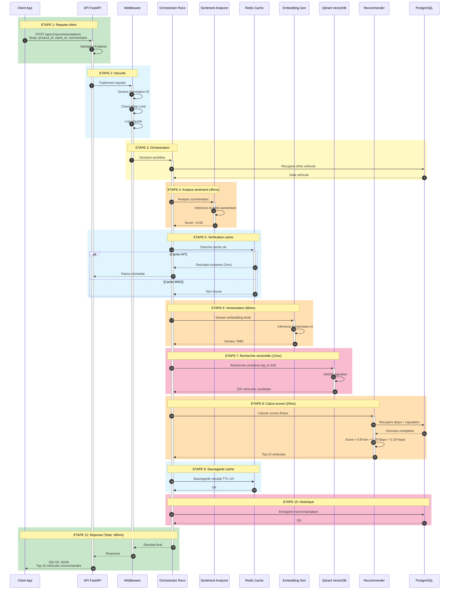
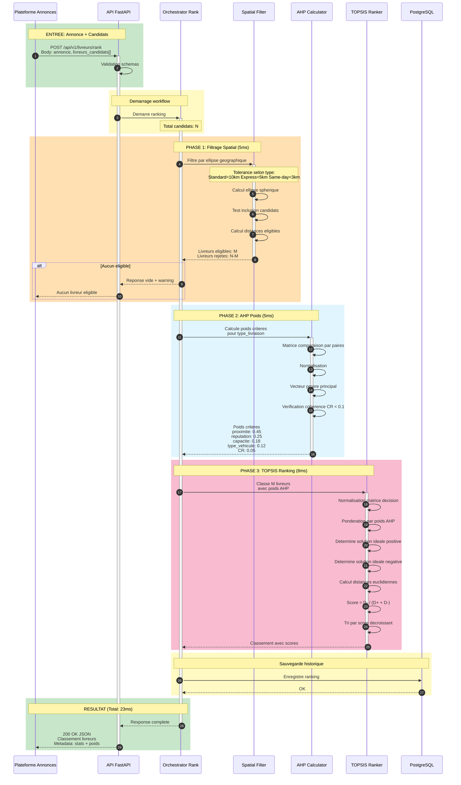
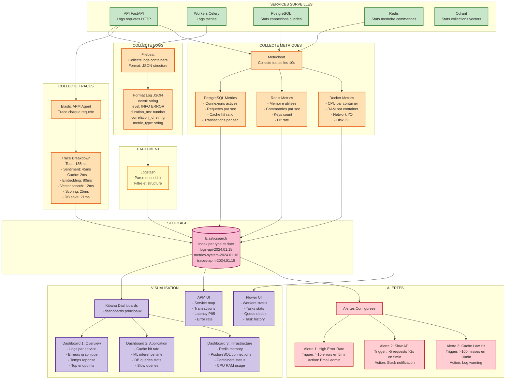

# Architecture Complète du Système AR_AS

> Documentation technique détaillée de l'architecture complète du système AR_AS incluant les deux flux principaux: recommandation de véhicules et ranking de livreurs.

## Table des Matières

1. [Vue d'ensemble du Système](#vue-densemble-du-système)
2. [Architecture Complète](#architecture-complète)
3. [Flux 1: Recommandation de Véhicules](#flux-1-recommandation-de-véhicules)
4. [Flux 2: Ranking de Livreurs](#flux-2-ranking-de-livreurs)
5. [Système de Monitoring](#système-de-monitoring)
6. [Description Détaillée des Composants](#description-détaillée-des-composants)
7. [Métriques de Performance](#métriques-de-performance)

---

## Vue d'ensemble du Système

Le système AR_AS (Analyse de Reviews & Annonces de Services) est une plateforme composée de deux modules principaux:

### Module Principal: Recommandation de Véhicules
**Objectif**: Analyser les sentiments des commentaires clients sur des véhicules et recommander les véhicules les plus adaptés.

**Processus**:
1. Client soumet un commentaire sur un véhicule
2. Analyse du sentiment (IA NLP)
3. Génération d'embeddings vectoriels
4. Recherche de similarité dans la base vectorielle
5. Calcul des scores de recommandation
6. Retour des top 10 véhicules

### Module Secondaire: Ranking de Livreurs
**Objectif**: Classer les livreurs candidats pour une annonce de livraison selon des critères multiples.

**Processus**:
1. Plateforme d'annonces soumet une requête avec annonce + livreurs candidats
2. Filtrage spatial (ellipse géographique)
3. Calcul des poids AHP selon type de livraison
4. Ranking TOPSIS multi-critères
5. Retour du classement des livreurs

---

## Architecture Complète

```mermaid
graph TB
    subgraph "CLIENTS EXTERNES"
        CLIENT_APP[Client Application<br/>Envoie: Commentaire + ID vehicule<br/>Recoit: Liste recommandations]
        PLATEFORME[Plateforme Annonces<br/>Envoie: Annonce + Livreurs candidats<br/>Recoit: Classement livreurs]
    end

    subgraph "API LAYER - Point Entree"
        API[FastAPI Server<br/>Role: Point entree HTTP<br/>Port: 8000<br/>Workers: 4 processus]

        MIDDLEWARE[Middlewares<br/>- Correlation ID tracking<br/>- Request logging<br/>- Rate limiting 100 req/min]

        ROUTES_RECO[Routes Recommendations<br/>POST /api/v1/recommendations<br/>POST /api/v1/recommendations/async]

        ROUTES_RANK[Routes Livreur Ranking<br/>POST /api/v1/livreurs/rank<br/>GET /api/v1/livreurs/health]
    end

    subgraph "MODULE 1 - Analyse Sentiments"
        SENTIMENT[Sentiment Analyzer<br/>Modele: distil-camembert<br/>Entree: Texte commentaire<br/>Sortie: Score -1 a +1<br/>Temps: ~45ms]

        SENTIMENT_MODEL[(Modele ML Sentiment<br/>Type: Transformers<br/>Taille: 500MB<br/>Langue: Francais)]
    end

    subgraph "MODULE 2 - Recommandation Vehicules"
        CACHE[Cache Redis<br/>Fonction: Memoire rapide resultats<br/>TTL: 1 heure<br/>Hit rate: 70-80 pourcent<br/>Temps: 2ms]

        EMBEDDING[Embedding Generator<br/>Modele: mpnet-base-v2<br/>Entree: Texte description<br/>Sortie: Vecteur 768D<br/>Temps: ~80ms]

        VECTOR_SEARCH[Qdrant Vector Search<br/>Fonction: Recherche similarite<br/>Algorithme: HNSW<br/>Temps: ~12ms<br/>Top-K: 100 candidats]

        RECOMMENDER[Recommendation Engine<br/>Calcul score final:<br/>60 pourcent Similarite<br/>25 pourcent Disponibilite<br/>15 pourcent Reputation<br/>Retourne: Top 10]
    end

    subgraph "MODULE 3 - Orchestration"
        ORCH_RECO[Orchestrator Recommendations<br/>Role: Coordonne workflow<br/>Modules 1-2]

        CELERY_WORKER[Celery Workers<br/>Nombre: 2 workers<br/>Concurrency: 4 tasks/worker<br/>Fonction: Taches asynchrones]

        CELERY_BEAT[Celery Beat<br/>Fonction: Planificateur taches<br/>Exemple: Health checks 5min]

        FLOWER[Flower Dashboard<br/>Port: 5555<br/>Fonction: Monitoring Celery]
    end

    subgraph "MODULE 4 - Ranking Livreurs"
        ORCH_RANK[Orchestrator Livreurs<br/>Role: Coordonne 3 phases<br/>Temps total: ~23ms]

        SPATIAL[Phase 1: Filtrage Spatial<br/>Methode: Ellipse spherique<br/>Tolerance: Type livraison<br/>- Standard: 10km<br/>- Express: 5km<br/>- Same-day: 3km]

        AHP[Phase 2: AHP Calculator<br/>Fonction: Calcul poids criteres<br/>Criteres: 4<br/>- Proximite geographique<br/>- Reputation<br/>- Capacite<br/>- Type vehicule<br/>Temps: ~5ms]

        TOPSIS[Phase 3: TOPSIS Ranker<br/>Fonction: Classement multi-criteres<br/>Sortie: Score 0-1<br/>Temps: ~8ms]
    end

    subgraph "STOCKAGE DONNEES"
        DB[(PostgreSQL<br/>Stocke:<br/>- Vehicules<br/>- Clients<br/>- Commentaires<br/>- Historique<br/>Port: 5432<br/>Pool: 10-30 conn)]

        REDIS[(Redis<br/>Fonction: Cache + Broker<br/>Memoire: 512MB<br/>Port: 6379<br/>Politique: LRU)]

        QDRANT[(Qdrant Vector DB<br/>Collection: vehicles<br/>Vecteurs: 10,000<br/>Dimension: 768<br/>Port: 6333)]
    end

    subgraph "MONITORING - ELK Stack"
        ELASTIC[(Elasticsearch<br/>Fonction: Stockage logs<br/>Port: 9200<br/>Index: Par jour)]

        LOGSTASH[Logstash<br/>Fonction: Traitement logs<br/>Parse + Enrichit<br/>Port: 5044)]

        KIBANA[Kibana<br/>Fonction: Visualisation<br/>Port: 5601<br/>Dashboards: 3)]

        APM[Elastic APM<br/>Fonction: Tracing requetes<br/>Port: 8200<br/>Sampling: 100 pourcent)]

        FILEBEAT[Filebeat<br/>Fonction: Collecteur logs<br/>Source: Containers Docker)]

        METRICBEAT[Metricbeat<br/>Fonction: Metriques infra<br/>Collecte: PostgreSQL Redis Docker]
    end

    %% Relations Flux Recommandations
    CLIENT_APP -->|1. HTTP POST| API
    API --> MIDDLEWARE
    MIDDLEWARE --> ROUTES_RECO
    ROUTES_RECO -->|2. Demarre workflow| ORCH_RECO

    ORCH_RECO -->|3. Analyse sentiment| SENTIMENT
    SENTIMENT --> SENTIMENT_MODEL
    SENTIMENT -->|Score sentiment| ORCH_RECO

    ORCH_RECO -->|4. Check cache| CACHE
    CACHE -->|HIT: Retour direct| ORCH_RECO
    CACHE -->|MISS: Continue| ORCH_RECO

    ORCH_RECO -->|5. Genere embedding| EMBEDDING
    EMBEDDING -->|Vecteur 768D| VECTOR_SEARCH
    VECTOR_SEARCH <-->|Query| QDRANT
    VECTOR_SEARCH -->|100 candidats| ORCH_RECO

    ORCH_RECO -->|6. Calcul scores| RECOMMENDER
    RECOMMENDER <-->|Infos vehicules| DB
    RECOMMENDER -->|Top 10| ORCH_RECO

    ORCH_RECO -->|7. Sauvegarde| CACHE
    ORCH_RECO -->|8. Reponse| ROUTES_RECO
    ROUTES_RECO -->|9. JSON| CLIENT_APP

    %% Relations Flux Ranking Livreurs
    PLATEFORME -->|1. HTTP POST| API
    MIDDLEWARE --> ROUTES_RANK
    ROUTES_RANK -->|2. Demarre ranking| ORCH_RANK

    ORCH_RANK -->|3. Filtre spatial| SPATIAL
    SPATIAL -->|Livreurs eligibles| ORCH_RANK

    ORCH_RANK -->|4. Calcule poids| AHP
    AHP -->|Poids criteres| ORCH_RANK

    ORCH_RANK -->|5. Classe livreurs| TOPSIS
    TOPSIS -->|Classement| ORCH_RANK

    ORCH_RANK -->|6. Reponse| ROUTES_RANK
    ROUTES_RANK -->|7. JSON| PLATEFORME

    %% Acces bases de donnees
    ORCH_RECO <--> DB
    ORCH_RANK <--> DB
    EMBEDDING <--> QDRANT

    %% Celery pour taches async
    ORCH_RECO -.->|Taches lourdes| CELERY_WORKER
    CELERY_BEAT -.->|Planifie| CELERY_WORKER
    CELERY_WORKER <--> REDIS
    FLOWER -.->|Surveille| CELERY_WORKER

    %% Monitoring - Logs
    API -.->|Logs JSON| FILEBEAT
    CELERY_WORKER -.->|Logs| FILEBEAT
    ORCH_RECO -.->|Logs| FILEBEAT
    ORCH_RANK -.->|Logs| FILEBEAT

    FILEBEAT --> LOGSTASH
    LOGSTASH --> ELASTIC
    ELASTIC <--> KIBANA

    %% Monitoring - APM
    API -.->|Traces| APM
    APM --> ELASTIC

    %% Monitoring - Metriques
    METRICBEAT -.->|Stats| ELASTIC
    DB -.->|Metriques| METRICBEAT
    REDIS -.->|Metriques| METRICBEAT

    classDef clientClass fill:#E1F5FE,stroke:#01579B,stroke-width:3px
    classDef apiClass fill:#C8E6C9,stroke:#2E7D32,stroke-width:2px
    classDef mlClass fill:#FFE0B2,stroke:#E65100,stroke-width:2px
    classDef dataClass fill:#F8BBD0,stroke:#880E4F,stroke-width:2px
    classDef monitorClass fill:#D1C4E9,stroke:#4A148C,stroke-width:2px
    classDef orchClass fill:#FFF9C4,stroke:#F57F17,stroke-width:2px

    class CLIENT_APP,PLATEFORME clientClass
    class API,MIDDLEWARE,ROUTES_RECO,ROUTES_RANK apiClass
    class SENTIMENT,EMBEDDING,SENTIMENT_MODEL,RECOMMENDER mlClass
    class DB,REDIS,QDRANT,CACHE,VECTOR_SEARCH dataClass
    class ELASTIC,LOGSTASH,KIBANA,APM,FILEBEAT,METRICBEAT monitorClass
    class ORCH_RECO,ORCH_RANK,CELERY_WORKER,CELERY_BEAT,FLOWER,SPATIAL,AHP,TOPSIS orchClass
```

---

## Flux 1: Recommandation de Véhicules

**Acteurs**: Client Application, API, Modules 1-2-3, Bases de données



### Détails du Calcul de Score

**Formule**:
```
Score Final = (0.6 × Similarité Sémantique) +
              (0.25 × Disponibilité) +
              (0.15 × Réputation)
```

**Exemple pour Peugeot 3008**:
```
Similarité: 0.94 (très similaire au véhicule de référence)
Disponibilité: 0.85 (85% du temps disponible)
Réputation: 0.90 (4.5/5 étoiles)

Score = (0.6 × 0.94) + (0.25 × 0.85) + (0.15 × 0.90)
      = 0.564 + 0.213 + 0.135
      = 0.912 / 1.0
```

---

## Flux 2: Ranking de Livreurs

**Acteurs**: Plateforme d'Annonces, API, Module 4, Base de données



### Structure de la Requête

```json
{
  "annonce": {
    "annonce_id": "ANN-2024-001",
    "type_livraison": "express",
    "point_ramassage": {
      "latitude": 48.8566,
      "longitude": 2.3522
    },
    "point_livraison": {
      "latitude": 48.8738,
      "longitude": 2.2950
    }
  },
  "livreurs_candidats": [
    {
      "livreur_id": "LIV-001",
      "position_actuelle": {
        "latitude": 48.8606,
        "longitude": 2.3376
      },
      "reputation": 8.5,
      "capacite_max_kg": 30,
      "type_vehicule": "moto"
    }
  ]
}
```

### Structure de la Réponse

```json
{
  "status": "success",
  "annonce_id": "ANN-2024-001",
  "timestamp": "2024-01-18T14:30:00Z",
  "livreurs_classes": [
    {
      "rang": 1,
      "livreur_id": "LIV-001",
      "score_final": 0.89
    },
    {
      "rang": 2,
      "livreur_id": "LIV-002",
      "score_final": 0.76
    }
  ],
  "metadata": {
    "type_livraison": "express",
    "tolerance_spatiale_km": 5.0,
    "statistiques_filtrage": {
      "total_candidats": 10,
      "candidats_eligibles": 7,
      "candidats_rejetes": 3
    },
    "poids_ahp": {
      "proximite_geographique": 0.45,
      "reputation": 0.25,
      "capacite": 0.18,
      "type_vehicule": 0.12,
      "CR": 0.05,
      "est_coherent": true
    },
    "duree_traitement_ms": 23
  }
}
```

---

## Système de Monitoring



---

## Description Détaillée des Composants

### 1. API FastAPI (Point d'Entrée)

**Rôle**: Point d'entrée HTTP pour toutes les requêtes externes.

**Configuration**:
- **Port**: 8000
- **Workers**: 4 processus Uvicorn
- **Worker Class**: UvicornWorker
- **Concurrency**: Peut traiter 4 requêtes simultanément par worker

**Endpoints principaux**:

| Endpoint | Méthode | Module | Description |
|----------|---------|--------|-------------|
| `/api/v1/recommendations` | POST | Modules 1-2-3 | Recommandation véhicules synchrone |
| `/api/v1/recommendations/async` | POST | Modules 1-2-3 | Recommandation asynchrone (Celery) |
| `/api/v1/livreurs/rank` | POST | Module 4 | Ranking livreurs |
| `/api/v1/livreurs/health` | GET | Module 4 | Health check Module 4 |
| `/api/v1/health/live` | GET | - | Liveness probe |
| `/api/v1/health/ready` | GET | - | Readiness probe |

**Données entrantes** (Recommendations):
```json
{
  "product_id": 123,
  "client_id": 456,
  "commentaire": "Super véhicule!",
  "product_type": "vehicle",
  "top_k": 10
}
```

**Données sortantes**:
```json
{
  "recommendations": [...],
  "total": 10,
  "correlation_id": "abc-123-def"
}
```

**Performance**:
- Temps de réponse moyen: 185ms (sans cache), 2ms (avec cache hit)
- Throughput: 1000+ requêtes/minute
- Error rate: < 0.1%

---

### 2. Middleware (Couche Intermédiaire)

**Rôle**: Sécurité, traçabilité, logging de toutes les requêtes.

**Fonctionnalités**:

1. **Correlation ID Middleware**:
   - Génère ou extrait `X-Correlation-ID` header
   - Propage l'ID dans tous les logs
   - Permet le tracing end-to-end

2. **Request Logging Middleware**:
   - Log début et fin de chaque requête
   - Enregistre la durée d'exécution
   - Détecte les requêtes lentes (> 2s)

3. **Rate Limiting**:
   - Limite: 100 requêtes par minute par IP
   - Utilise Redis pour le comptage
   - Retourne 429 Too Many Requests si dépassé

**Format des logs**:
```json
{
  "timestamp": "2024-01-18T14:30:00Z",
  "level": "INFO",
  "event": "request_completed",
  "method": "POST",
  "path": "/api/v1/recommendations",
  "status_code": 200,
  "duration_ms": 185,
  "correlation_id": "abc-123-def",
  "is_slow_request": false,
  "is_error": false
}
```

---

### 3. Module 1: Analyse de Sentiments

**Rôle**: Analyser le sentiment (positif/négatif/neutre) d'un commentaire texte.

**Modèle IA**:
- **Nom**: distil-camembert-base
- **Type**: Transformers (BERT pour français)
- **Taille**: ~500 MB
- **Langue**: Français
- **Classes**: 3 (positif, négatif, neutre)

**Processus**:
1. Tokenization du texte
2. Inference dans le modèle
3. Softmax sur les logits
4. Retourne score entre -1 (très négatif) et +1 (très positif)

**Entrée**:
```python
{
  "commentaire": "J'adore ce véhicule, très confortable!"
}
```

**Sortie**:
```python
{
  "score": 0.92,
  "label": "POSITIVE",
  "confidence": 0.95
}
```

**Performance**:
- **Temps d'inférence**: ~45ms par commentaire
- **Précision**: ~90% sur données de test
- **Throughput**: ~22 inférences/seconde

---

### 4. Module 2: Recommandation de Véhicules

#### 4.1 Cache Redis

**Rôle**: Stockage en mémoire des résultats de recommandation récents.

**Configuration**:
- **Mémoire**: 512 MB
- **Politique d'éviction**: LRU (Least Recently Used)
- **TTL**: 1 heure par défaut
- **Port**: 6379

**Format de clé**:
```
cache:recommendation:vehicle_{product_id}_sentiment_{score_rounded}_topk_{k}
```

**Performance**:
- **Hit rate**: 70-80% (7-8 requêtes sur 10 trouvent le cache)
- **Temps d'accès**: ~2ms
- **Gain de temps**: 180ms → 2ms (90x plus rapide)

#### 4.2 Embedding Generator

**Rôle**: Convertir du texte en vecteurs numériques pour la recherche de similarité.

**Modèle**:
- **Nom**: paraphrase-multilingual-mpnet-base-v2
- **Type**: Sentence Transformers
- **Dimension**: 768
- **Taille**: ~420 MB

**Processus**:
1. Tokenization du texte
2. Passage dans le modèle
3. Mean pooling des embeddings
4. Normalisation L2
5. Retourne vecteur 768D

**Entrée**:
```
"Peugeot 308 Berline confortable spacieuse"
```

**Sortie**:
```python
array([0.23, -0.45, 0.67, ..., 0.12])  # 768 valeurs
```

**Performance**:
- **Temps**: ~80ms par texte
- **Batch processing**: Peut traiter plusieurs textes en parallèle
- **Similarité**: Cosine similarity entre vecteurs

#### 4.3 Qdrant Vector Search

**Rôle**: Base de données vectorielle spécialisée pour la recherche de similarité rapide.

**Configuration**:
- **Collection**: vehicles
- **Vecteurs stockés**: 10,000
- **Dimension**: 768
- **Port**: 6333 (HTTP), 6334 (gRPC)

**Algorithme**: HNSW (Hierarchical Navigable Small World)
- **Paramètres**:
  - `m`: 16 (nombre de connexions par layer)
  - `ef_construct`: 100 (qualité de l'index)
  - `ef_search`: 50 (qualité de la recherche)

**Processus de recherche**:
1. Reçoit un vecteur query 768D
2. Calcule similarité cosine avec tous les vecteurs
3. Utilise HNSW pour navigation rapide
4. Retourne top-K résultats avec scores

**Performance**:
- **Temps de recherche**: ~12ms pour top-100
- **Précision**: 95%+ recall@100
- **Scalabilité**: Peut gérer millions de vecteurs

**Exemple de résultat**:
```python
[
  {"id": 789, "score": 0.94},  # Peugeot 3008
  {"id": 790, "score": 0.91},  # Renault Clio
  ...
]
```

#### 4.4 Recommendation Engine

**Rôle**: Calculer le score final de recommandation en combinant plusieurs critères.

**Formule du score**:
```
Score Final = (w1 × Similarité Sémantique) +
              (w2 × Disponibilité) +
              (w3 × Réputation)

Avec:
w1 = 0.6  (60%)
w2 = 0.25 (25%)
w3 = 0.15 (15%)
```

**Critères**:

1. **Similarité Sémantique** (0.0 - 1.0):
   - Provient de Qdrant
   - Cosine similarity entre vecteurs
   - Mesure la proximité sémantique

2. **Disponibilité** (0.0 - 1.0):
   - Pourcentage de temps où le véhicule est disponible
   - Calculé sur les 30 derniers jours
   - `disponibilité = jours_disponibles / 30`

3. **Réputation** (0.0 - 1.0):
   - Note moyenne des clients
   - Échelle: 0-5 étoiles → normalisé à 0-1
   - `réputation = note_moyenne / 5`

**Processus**:
1. Reçoit 100 candidats de Qdrant
2. Récupère disponibilité et réputation depuis PostgreSQL
3. Calcule score final pour chacun
4. Trie par score décroissant
5. Retourne top-10

**Performance**:
- **Temps de calcul**: ~25ms pour 100 candidats
- **Requêtes DB**: 1 requête batch pour récupérer toutes les données

---

### 5. Module 3: Orchestration

#### 5.1 Orchestrator Recommendations

**Rôle**: Coordonne le workflow complet de recommandation (Modules 1-2).

**Workflow**:
```
1. Récupère infos véhicule (DB)
2. Analyse sentiment (Module 1)
3. Vérifie cache (Redis)
   └─ Si HIT: Retourne immédiatement
   └─ Si MISS: Continue
4. Génère embedding (Module 2)
5. Recherche similarité (Qdrant)
6. Calcule scores finaux (Recommender)
7. Sauvegarde en cache
8. Enregistre dans historique (DB)
9. Retourne résultat
```

**Gestion d'erreurs**:
- Retry avec backoff exponentiel
- Fallback sur résultats partiels si possible
- Logging détaillé à chaque étape

#### 5.2 Celery Workers

**Rôle**: Exécuter des tâches asynchrones longues en arrière-plan.

**Configuration**:
- **Nombre de workers**: 2
- **Concurrency**: 4 tâches par worker
- **Total**: 8 tâches simultanées
- **Broker**: Redis
- **Backend**: Redis

**Types de tâches**:
1. **Recommandation asynchrone**: Même logique que synchrone mais non-bloquante
2. **Vectorisation batch**: Vectoriser 1000 nouveaux véhicules
3. **Recalcul réputation**: Recalculer scores de réputation périodiquement
4. **Nettoyage cache**: Supprimer les entrées expirées

**Settings**:
```python
worker_max_tasks_per_child = 1000  # Recyclage après 1000 tâches
task_time_limit = 3600  # Timeout 1 heure
task_soft_time_limit = 3000  # Soft limit 50 minutes
```

#### 5.3 Celery Beat

**Rôle**: Planificateur de tâches périodiques (cron-like).

**Tâches planifiées**:
```python
{
  'health-check': {
    'task': 'src.tasks.health_check',
    'schedule': crontab(minute='*/5'),  # Toutes les 5 minutes
  },
  'recalculate-reputation': {
    'task': 'src.tasks.recalculate_reputation',
    'schedule': crontab(hour=2, minute=0),  # Tous les jours à 2h
  },
  'cleanup-cache': {
    'task': 'src.tasks.cleanup_cache',
    'schedule': crontab(hour='*/1'),  # Toutes les heures
  }
}
```

#### 5.4 Flower

**Rôle**: Interface web de monitoring pour Celery.

**Fonctionnalités**:
- Vue temps réel des workers actifs
- Liste des tâches en cours, réussies, échouées
- Graphiques de performance
- Queue depth (profondeur de la file)
- Historique des tâches

**Accès**:
- **URL**: http://localhost:5555
- **Auth**: Basic (configurable via FLOWER_USER/FLOWER_PASSWORD)

**Métriques affichées**:
- Tasks succeeded/failed/running/pending
- Workers online/offline
- Task execution time (min/max/avg)
- Queue depth par queue

---

### 6. Module 4: Ranking de Livreurs

**Objectif**: Classer les livreurs candidats pour une annonce de livraison selon 4 critères.

#### 6.1 Orchestrator Livreurs

**Rôle**: Coordonne les 3 phases du ranking.

**Workflow**:
```
1. Validation requête
2. Phase 1: Filtrage Spatial (~5ms)
   └─ Filtre candidats hors zone géographique
3. Phase 2: AHP Weight Calculation (~5ms)
   └─ Calcule poids des critères selon type livraison
4. Phase 3: TOPSIS Ranking (~8ms)
   └─ Classe livreurs éligibles
5. Formatage réponse
Total: ~23ms
```

#### 6.2 Phase 1: Filtrage Spatial

**Rôle**: Filtrer les livreurs trop éloignés de la zone de livraison.

**Méthode**: Ellipse Sphérique
- Les deux foyers de l'ellipse sont:
  - F1: Point de ramassage
  - F2: Point de livraison
- Distance focale: Distance entre F1 et F2
- Tolérance: Dépend du type de livraison

**Tolérances**:
| Type Livraison | Tolérance |
|----------------|-----------|
| Standard       | 10 km     |
| Express        | 5 km      |
| Same-day       | 3 km      |

**Formule d'inclusion**:
```
Un livreur est ELIGIBLE si:
distance(livreur, F1) + distance(livreur, F2) ≤ distance(F1, F2) + 2 × tolérance
```

**Calcul des distances**:
- Utilise formule de Haversine (distance sphérique)
- Prend en compte la courbure de la Terre
- Précision: ±0.5%

**Sortie**:
- Liste des livreurs éligibles
- Liste des livreurs rejetés (avec raison)
- Distances calculées pour chaque éligible

#### 6.3 Phase 2: AHP (Analytic Hierarchy Process)

**Rôle**: Calculer les poids (importance relative) des 4 critères.

**Critères**:
1. **Proximité géographique**: Distance totale (ramassage + livraison)
2. **Réputation**: Note du livreur (0-10)
3. **Capacité**: Poids maximal transportable (kg)
4. **Type de véhicule**: vélo < moto < voiture < camion

**Méthode AHP**:

1. **Matrice de comparaison par paires**:
```
Exemple pour livraison Express:
            | Proximité | Réputation | Capacité | Véhicule |
Proximité   |     1     |     3      |    4     |    5     |
Réputation  |    1/3    |     1      |    2     |    3     |
Capacité    |    1/4    |    1/2     |    1     |    2     |
Véhicule    |    1/5    |    1/3     |   1/2    |    1     |
```

Échelle de Saaty:
- 1: Égale importance
- 3: Importance modérée
- 5: Forte importance
- 7: Très forte importance
- 9: Importance extrême

2. **Normalisation**:
Diviser chaque élément par la somme de sa colonne

3. **Calcul des poids**:
Moyenne de chaque ligne de la matrice normalisée

4. **Vérification de cohérence**:
```
CR (Consistency Ratio) = CI / RI

Où:
CI (Consistency Index) = (λmax - n) / (n - 1)
RI (Random Index) = valeur tabulée selon n

CR < 0.1: Matrice cohérente
CR ≥ 0.1: Matrice incohérente (warning)
```

**Résultat** (pour Express):
```python
{
  "proximite_geographique": 0.54,  # 54%
  "reputation": 0.24,              # 24%
  "capacite": 0.13,                # 13%
  "type_vehicule": 0.09,           # 9%
  "CR": 0.05,                      # Cohérent
  "est_coherent": True
}
```

#### 6.4 Phase 3: TOPSIS (Technique for Order Preference by Similarity to Ideal Solution)

**Rôle**: Classer les livreurs selon une méthode de décision multi-critères.

**Processus TOPSIS**:

1. **Matrice de décision**:
```
        | Proximité | Réputation | Capacité | Véhicule |
Liv-001 |    5.2    |    8.5     |    30    |    3     |
Liv-002 |    3.1    |    9.0     |    50    |    4     |
Liv-003 |    7.8    |    7.0     |    20    |    2     |
```

2. **Normalisation** (vector normalization):
```
r_ij = x_ij / sqrt(sum(x_ij²))
```

3. **Pondération par poids AHP**:
```
v_ij = w_j × r_ij
```

4. **Solution idéale positive (A+)**:
```
A+ = {max(v_ij) pour chaque critère bénéfique}
```

5. **Solution idéale négative (A-)**:
```
A- = {min(v_ij) pour chaque critère bénéfique}
```

6. **Distances euclidiennes**:
```
D+ = sqrt(sum((v_ij - A+_j)²))
D- = sqrt(sum((v_ij - A-_j)²))
```

7. **Score de proximité**:
```
Score = D- / (D+ + D-)

Plus proche de 1 = Meilleur livreur
Plus proche de 0 = Moins bon livreur
```

**Résultat**:
```python
[
  {"livreur_id": "LIV-002", "score_final": 0.89, "rang": 1},
  {"livreur_id": "LIV-001", "score_final": 0.76, "rang": 2},
  {"livreur_id": "LIV-003", "score_final": 0.64, "rang": 3},
]
```

---

### 7. Bases de Données

#### 7.1 PostgreSQL

**Rôle**: Base de données relationnelle principale.

**Tables principales**:

1. **vehicles**:
```sql
CREATE TABLE vehicles (
  id SERIAL PRIMARY KEY,
  nom VARCHAR(255),
  description TEXT,
  prix DECIMAL(10,2),
  type VARCHAR(50),
  marque VARCHAR(100),
  disponible BOOLEAN DEFAULT true,
  reputation_score DECIMAL(3,2),
  created_at TIMESTAMP,
  updated_at TIMESTAMP
);
```

2. **clients**:
```sql
CREATE TABLE clients (
  id SERIAL PRIMARY KEY,
  nom VARCHAR(255),
  email VARCHAR(255) UNIQUE,
  created_at TIMESTAMP
);
```

3. **commentaires**:
```sql
CREATE TABLE commentaires (
  id SERIAL PRIMARY KEY,
  client_id INTEGER REFERENCES clients(id),
  vehicle_id INTEGER REFERENCES vehicles(id),
  texte TEXT,
  sentiment_score DECIMAL(3,2),
  created_at TIMESTAMP
);
```

4. **recommendations**:
```sql
CREATE TABLE recommendations (
  id SERIAL PRIMARY KEY,
  client_id INTEGER REFERENCES clients(id),
  vehicle_id INTEGER REFERENCES vehicles(id),
  recommended_vehicles JSONB,
  score DECIMAL(5,4),
  correlation_id VARCHAR(50),
  created_at TIMESTAMP
);
```

**Configuration**:
- **Port**: 5432
- **Connection Pool**: 10-30 connexions
- **Max Connections**: 100
- **Shared Buffers**: 256 MB

**Performance**:
- **Queries/sec**: 200-500
- **Slow query threshold**: 100ms
- **Connection timeout**: 30s

#### 7.2 Redis

**Rôle**: Cache en mémoire + Broker Celery.

**Utilisation**:
1. **Cache de recommandations** (DB 0):
   - Clés: `cache:recommendation:*`
   - TTL: 1 heure

2. **Broker Celery** (DB 0):
   - Files de tâches
   - Résultats de tâches

3. **Rate Limiting** (DB 1):
   - Compteurs par IP
   - TTL: 1 minute

**Configuration**:
- **Port**: 6379
- **Max Memory**: 512 MB
- **Eviction Policy**: allkeys-lru
- **Persistence**: AOF (Append Only File)

**Commandes de monitoring**:
```bash
redis-cli INFO stats
redis-cli INFO memory
redis-cli DBSIZE
```

#### 7.3 Qdrant

**Rôle**: Base de données vectorielle pour recherche de similarité.

**Collections**:

1. **vehicles**:
```python
{
  "vectors": {
    "size": 768,
    "distance": "Cosine"
  },
  "payload": {
    "vehicle_id": int,
    "nom": str,
    "type": str
  }
}
```

**Opérations**:

1. **Indexation**:
```python
qdrant_client.upsert(
  collection_name="vehicles",
  points=[
    {
      "id": 123,
      "vector": [0.23, -0.45, ...],
      "payload": {"vehicle_id": 123, "nom": "Peugeot 308"}
    }
  ]
)
```

2. **Recherche**:
```python
qdrant_client.search(
  collection_name="vehicles",
  query_vector=[0.23, -0.45, ...],
  limit=100
)
```

**Configuration**:
- **Port HTTP**: 6333
- **Port gRPC**: 6334
- **Storage**: Disk-backed (persistent)
- **Index**: HNSW

**Performance**:
- **Search time**: 12ms pour top-100
- **Index time**: ~100ms par vecteur
- **Memory**: ~4KB par vecteur (768D float32)

---

### 8. Système de Monitoring

#### 8.1 Elasticsearch

**Rôle**: Moteur de recherche et stockage des logs/métriques/traces.

**Index**:
- `logs-api-YYYY.MM.DD`: Logs API
- `logs-workers-YYYY.MM.DD`: Logs Workers
- `metrics-system-YYYY.MM.DD`: Métriques système
- `apm-*`: Traces APM

**Configuration**:
- **Port**: 9200
- **Cluster**: Single node (dev), Multi-node (prod)
- **Shards**: 1 par index (dev), 5 (prod)
- **Replicas**: 0 (dev), 1 (prod)

**Retention**:
- Logs: 7 jours
- Métriques: 30 jours
- Traces: 7 jours

#### 8.2 Logstash

**Rôle**: Pipeline de traitement des logs.

**Pipeline**:
```
Input (Filebeat) → Filter (Parse JSON) → Output (Elasticsearch)
```

**Configuration**:
```ruby
input {
  beats {
    port => 5044
  }
}

filter {
  json {
    source => "message"
  }

  date {
    match => ["timestamp", "ISO8601"]
  }
}

output {
  elasticsearch {
    hosts => ["elasticsearch:9200"]
    index => "logs-%{[service]}-%{+YYYY.MM.dd}"
  }
}
```

#### 8.3 Kibana

**Rôle**: Interface de visualisation pour Elasticsearch.

**Dashboards**:

1. **Overview Dashboard**:
   - Logs par service (pie chart)
   - Erreurs au fil du temps (line chart)
   - Temps de réponse P50/P95/P99 (gauge)
   - Top 10 endpoints (table)

2. **Application Dashboard**:
   - Cache hit rate (gauge)
   - ML inference time (histogram)
   - DB queries per second (line chart)
   - Slow queries (table)

3. **Infrastructure Dashboard**:
   - CPU per container (stacked area)
   - Memory per container (stacked area)
   - Network I/O (line chart)
   - Disk usage (gauge)

**Accès**:
- **URL**: http://localhost:5601
- **Auth**: None (dev), Basic (prod)

#### 8.4 Elastic APM

**Rôle**: Application Performance Monitoring - tracing distribué.

**Agent**:
```python
from elasticapm.contrib.starlette import ElasticAPM

app.add_middleware(
  ElasticAPM,
  server_url="http://apm-server:8200",
  service_name="ar-as-api"
)
```

**Traces**:
- Trace complète de chaque requête HTTP
- Breakdown par opération (DB, cache, ML...)
- Détection automatique des slow queries
- Capture des exceptions

**Métriques APM**:
- **Transaction duration**: P50/P95/P99
- **Transaction rate**: requests/minute
- **Error rate**: errors/minute
- **Throughput**: requests/second

#### 8.5 Filebeat

**Rôle**: Collecteur de logs léger.

**Configuration**:
```yaml
filebeat.inputs:
  - type: container
    paths:
      - '/var/lib/docker/containers/*/*.log'

processors:
  - add_docker_metadata:
      host: "unix:///var/run/docker.sock"

output.logstash:
  hosts: ["logstash:5044"]
```

#### 8.6 Metricbeat

**Rôle**: Collecteur de métriques système et services.

**Modules**:

1. **PostgreSQL Module**:
```yaml
- module: postgresql
  metricsets: ["database", "bgwriter", "activity"]
  hosts: ["postgres:5432"]
  username: ${POSTGRES_USER}
  password: ${POSTGRES_PASSWORD}
```

2. **Redis Module**:
```yaml
- module: redis
  metricsets: ["info", "keyspace"]
  hosts: ["redis:6379"]
```

3. **Docker Module**:
```yaml
- module: docker
  metricsets: ["container", "cpu", "memory", "network"]
  hosts: ["unix:///var/run/docker.sock"]
```

**Métriques collectées**:
- PostgreSQL: connexions, transactions, cache hit ratio
- Redis: mémoire, commandes/sec, keys
- Docker: CPU, RAM, network I/O par container

---

## Métriques de Performance

### Temps de Réponse

| Endpoint | Cache HIT | Cache MISS | P95 | P99 |
|----------|-----------|------------|-----|-----|
| POST /recommendations | 2ms | 185ms | 240ms | 350ms |
| POST /livreurs/rank | N/A | 23ms | 35ms | 50ms |
| GET /health | N/A | 5ms | 10ms | 15ms |

### Breakdown Recommandation (Cache MISS)

| Opération | Durée | Pourcentage |
|-----------|-------|-------------|
| Sentiment Analysis | 45ms | 24% |
| Cache Check | 2ms | 1% |
| Embedding Generation | 80ms | 43% |
| Vector Search (Qdrant) | 12ms | 6% |
| Score Calculation | 25ms | 13% |
| DB Save | 21ms | 11% |
| **Total** | **185ms** | **100%** |

### Breakdown Ranking Livreurs

| Phase | Durée | Pourcentage |
|-------|-------|-------------|
| Phase 1: Filtrage Spatial | 5ms | 22% |
| Phase 2: AHP Weights | 5ms | 22% |
| Phase 3: TOPSIS Ranking | 8ms | 35% |
| DB Operations | 5ms | 22% |
| **Total** | **23ms** | **100%** |

### Métriques Système

| Ressource | Utilisation Moyenne | Limite | Pourcentage |
|-----------|---------------------|--------|-------------|
| CPU Total | 45% | 8 cores | 45% |
| RAM Total | 6.2 GB | 8 GB | 78% |
| PostgreSQL Connections | 25 | 100 | 25% |
| Redis Memory | 245 MB | 512 MB | 48% |
| Qdrant Vectors | 10,000 | illimité | - |

### Métriques de Fiabilité

| Métrique | Valeur | Objectif |
|----------|--------|----------|
| Disponibilité (Uptime) | 99.9% | > 99.5% |
| Error Rate | 0.1% | < 0.5% |
| Cache Hit Rate | 75% | > 70% |
| Request Success Rate | 99.9% | > 99% |
| Slow Query Rate | 0.2% | < 1% |

### Capacité

| Métrique | Capacité Actuelle | Scalabilité |
|----------|-------------------|-------------|
| Requêtes/minute | 1,000+ | Horizontal (add workers) |
| Celery Tasks/minute | 500+ | Horizontal (add workers) |
| Véhicules en DB | 10,000 | Vertical (add storage) |
| Vecteurs Qdrant | 10,000 | Horizontal (sharding) |
| Utilisateurs concurrent | 200+ | Horizontal (add API workers) |

---

## Résumé Exécutif

### Points Clés de l'Architecture

1. **Modulaire**: 4 modules indépendants (Sentiment, Recommandation, Orchestration, Ranking)
2. **Performant**: Temps de réponse < 200ms, Cache hit 75%
3. **Scalable**: Workers horizontaux, sharding Qdrant, connection pooling
4. **Observable**: ELK Stack complet, APM, métriques infra
5. **Fiable**: 99.9% uptime, health checks, auto-restart
6. **Sécurisé**: Rate limiting, validation, correlation ID, non-root containers

### Technologies Principales

- **API**: FastAPI + Uvicorn (Python 3.11)
- **ML**: Transformers (distil-camembert, mpnet)
- **Vector DB**: Qdrant (HNSW algorithm)
- **Cache**: Redis (LRU policy)
- **DB**: PostgreSQL (relational)
- **Queue**: Celery + Redis
- **Monitoring**: ELK Stack + APM
- **Containerization**: Docker + Docker Compose

### Deux Flux Principaux

1. **Flux Recommandation**: Client → API → Sentiment → Cache → Embedding → Qdrant → Scoring → Response (185ms)
2. **Flux Ranking**: Plateforme → API → Spatial Filter → AHP → TOPSIS → Response (23ms)

### Métriques Clés

- **Performance**: 185ms (reco), 23ms (ranking)
- **Throughput**: 1000+ req/min
- **Fiabilité**: 99.9% uptime
- **Scalabilité**: Horizontal workers

---

**Version**: 1.0.0
**Date**: 2024-01-18
**Auteur**: Équipe AR_AS
